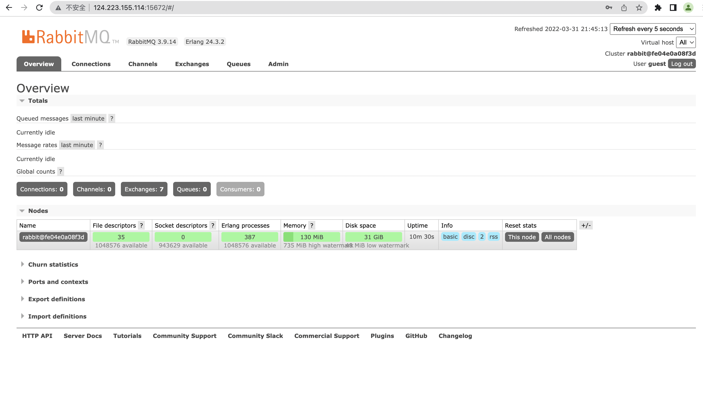

1. 获取镜像

   ```sh
   docker pull rabbitmq:3.9.14-management
   ```

   ```sh
   docker images
   ```
   
2. 创建本地挂载目录

   ```sh
   mkdir -p ~/docker/rabbitmq
   ```

3. 暂时创建一个无文件挂载的容器（以下步骤是为了解决：**直接创建带文件挂载的容器会启动报错，无权限访问文件**的问题）

   ```sh
   docker run --name rabbitmq \
   -p 5672:5672 \
   -p 15672:15672 \
   --restart=always \
   --privileged=true \
   -d rabbitmq:3.9.14-management
   ```
   
4. 将容器中的文件复制出来到宿主机上

   ```sh
   docker cp -a rabbitmq:/etc/rabbitmq ~/docker/rabbitmq/conf
   ```

   ```sh
   docker cp -a rabbitmq:/var/lib/rabbitmq ~/docker/rabbitmq/data
   ```

   ```sh
   docker cp -a rabbitmq:/var/log/rabbitmq ~/docker/rabbitmq/log
   ```

5. 停止容器并重新启动挂载文件的容器

   ```sh
   docker stop rabbitmq
   ```

   ```sh
   docker rm rabbitmq
   ```

   ```sh
   docker run --name rabbitmq \
   -p 5672:5672 \
   -p 15672:15672 \
   -v ~/docker/rabbitmq/log:/var/log/rabbitmq \
   -v ~/docker/rabbitmq/data:/var/lib/rabbitmq \
   -v ~/docker/rabbitmq/conf:/etc/rabbitmq \
   --restart=always \
   --privileged=true \
   -d rabbitmq:3.9.14-management
   ```

   - 5672：AMQP端口
   - 15672：web管理后台端口

6. 测试登录管理台：服务器 IP + 15672，账号密码默认是 guest/guest

   