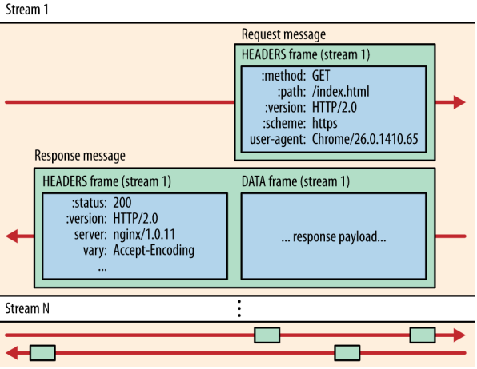
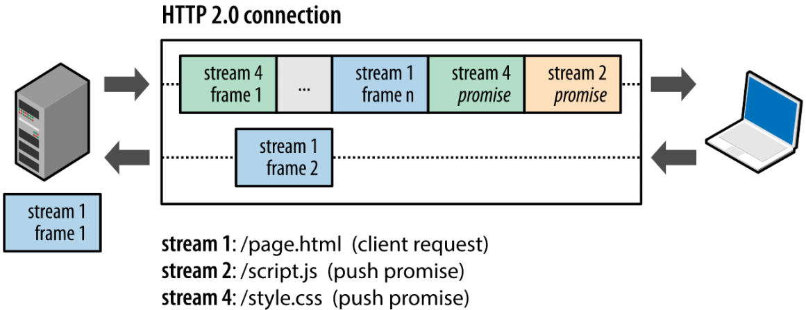

## 一、二进制分帧

二进制分帧是`HTTP/2`的一项核心特性。在二进制分帧层上，`HTTP/2`会将所有传输的信息分割为更小的消息（Message）和帧（Frame），并对它们采用二进制格式的编码 ，其中首部信息会被封装到`Headers Frame`，而数据部分则封装到`Data Frame`里面。帧是数据传输的最小单位，以二进制传输代替原本的明文传输。

`HTTP/2`中所有的通信都在**一个`TCP`连接**上完成，这个连接可以承载任意数量的双向数据流。相应地，每个数据流以消息的形式发送，而消息由一或多个帧组成，这些帧可以乱序发送，然后再根据每个帧首部的流标识符重新组装。

- **Connection**：1 个 TCP 连接，包含 1 个或者多个 stream。所有通信都在一个 TCP 连接上完成，此连接可以承载任意数量的双向数据流。
- **Stream**：一个双向通信的数据流，包含 1 条或者多条 Message。每个数据流都有一个唯一的标识符和可选的优先级信息，用于承载双向消息。流是连接中的一个虚拟信道，可以承载双向消息传输。每个流有唯一整数标识符（Stream ID）。为了防止两端流ID冲突，客户端发起的流具有奇数ID，服务器端发起的流具有偶数ID。
- **Message**：消息是指**逻辑上的HTTP消息**（请求/响应）。一系列数据帧组成了一个完整的消息。比如一系列DATA帧和一个HEADERS帧组成了请求消息。
- **Frame**：最小通信单位，以二进制压缩格式存放内容。来自不同数据流的帧可以交错发送，然后再根据每个帧头的数据流标识符重新组装。

## 二、头部压缩

`HTTP/2`协议中定义了`HPACK`，这是一种新的压缩方法，它消除了多余的`header`字段，将漏洞限制到已知的安全攻击，并且在受限的环境中具有有限的内存需求。`HPACK`格式特意被设计成简单且不灵活的形式：两种特性都降低了由于实现错误而引起的互操作性或安全性问题的风险；没有定义扩展机制，只能通过定义完整的替换来更改格式。需要注意的是，`HTTP/2`关注的是首部压缩，而我们常用的`gzip`等是报文内容的压缩，二者不仅不冲突，且能够一起达到更好的压缩效果。

头部压缩的过程：

1. 支持`HTTP/2`的客户端和服务端都维护一份相同的静态表（Static Table），包含常见的头部名称，以及常见的头部名称与值的组合（静态表内容共61项，索引号1-61）
2. 客户端和服务端都维护一份相同的动态表（Dynamic Table），当一个 header name 或者 header value 在静态表中不存在，会被插入动态表中，可以动态地添加内容（动态表索引从62开始）
3. 对于维护动态表的情况，在客户端第一次发送的时候需要明文发送（要经过Huffman编码），动态表将头部明文信息与编码值索引建立关系，第二次及第 N 次发送就可以直接使用索引号了

## 三、多路复用

`HTTP/2`连接都是持久化的，而且客户端与服务器之间也只需要一个连接（每个域名一个连接）即可。`HTTP/2`连接可以承载数十或数百个流的复用，多路复用意味着来自很多流的数据包能够混合在一起通过同样连接传输。当到达终点时，再根据不同帧首部的流标识符重新连接将不同的数据流进行组装。注意，在这个过程中 stream 流上**发送帧的顺序非常重要**，因为必须要保证接收端能够按照顺序处理帧，这是由于帧上仅携带了 Stream ID 标识流，但没有任何参数能够记录帧的序列。

## 四、服务器推送

服务器可以对一个客户端请求发送多个响应，服务器向客户端推送资源无需客户端明确地请求。并且，服务端推送能把客户端所需要的资源伴随着`index.html`一起发送到客户端，省去了客户端重复请求的步骤。

当服务端需要主动推送某个资源时，便会发送一个`Frame Type`为`PUSH_PROMISE`的`Frame`，里面带了`PUSH`需要新建的`Stream ID`。意思是告诉客户端：接下来我要用这个`ID`向你发送东西，客户端准备好接着。客户端解析`Frame`时，发现它是一个`PUSH_PROMISE`类型，便会准备接收服务端要推送的流。

