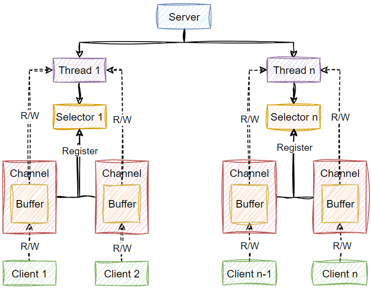
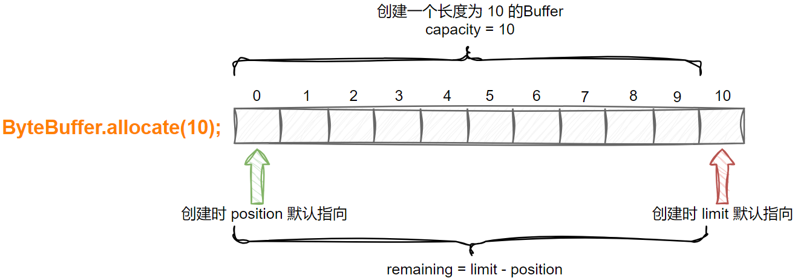
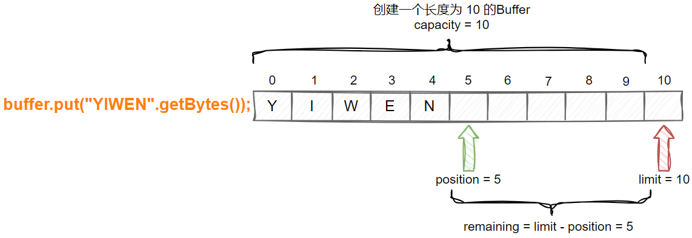
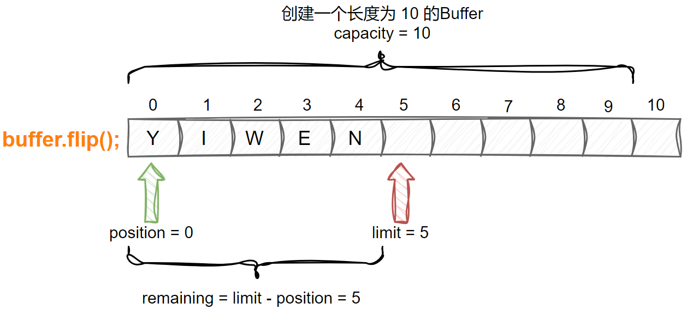
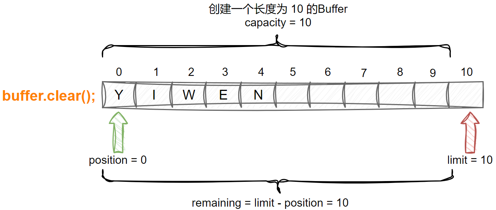
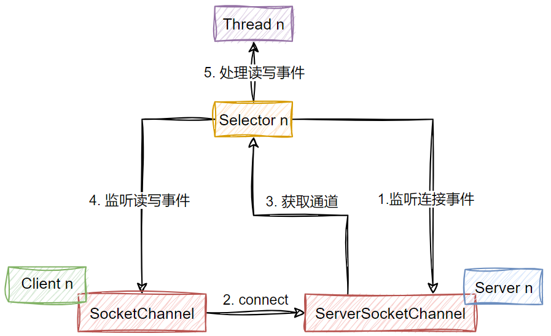

> `Java`共支持三种网络`IO`模型，分别是：BIO（同步阻塞）、NIO（同步非阻塞）、AIO（异步非阻塞）
>
> - 阻塞与非阻塞：指的是线程在访问资源的时候，对于资源未准备就绪的状态，会进行挂起等待直到资源就绪
> - 同步与异步：指的是线程获取资源的机制，可以让资源基于回调的方式，在合适的时机给到处理的线程

## 一、BIO

`BIO`举例就是传统的`Socket`编程，当有客户端请求过来的时候，服务端会为这个请求分配一个线程来做处理，期间这个线程无法做别的事情，即使这个请求没有做任何实际的事情。


`BIO`的问题：

- 每个请求都需要创建独立的线程分配给对应的客户端服务
- 并发数较大时，需要创建大量线程来处理连接，系统资源占用较大
- 连接建立后，如果当前线程暂时没有数据可读，则线程就阻塞在`Read`操作上，造成线程资源浪费

编程示例：

```java
/**
 * 文件描述
 *
 * @Project yiwenup-sample
 * @Package cloud.yiwenup.sample.socket
 * @Author yiwenup
 * @Description 服务端
 */
public class ServerDemo {

    public static final Executor EXECUTOR = Executors.newFixedThreadPool(3);

    public static void main(String[] args) throws Exception {
        try (ServerSocket serverSocket = new ServerSocket(9999)) {
            System.out.println("服务端启动...");
            while (true) {
                Socket accept = serverSocket.accept();
                System.out.println("监听客户端...");
                EXECUTOR.execute(() -> {
                    handle(accept);
                });
            }
        }
    }

    private static void handle(Socket accept) {
        try (
                InputStream is = accept.getInputStream();
                OutputStream os = accept.getOutputStream();
        ) {
            byte[] bytes = new byte[1024];
            int read = is.read(bytes);
            System.out.println("服务端线程" + Thread.currentThread().getName() + "接收到客户端消息：" + new String(bytes, 0, read));
            os.write("服务端收到".getBytes());
        } catch (Exception ignored) {

        }

    }
}
```

```java
/**
 * 文件描述
 *
 * @Project yiwenup-sample
 * @Package cloud.yiwenup.sample.socket
 * @Author yiwenup
 * @Description 客户端
 */
public class ClientDemo {
    public static void main(String[] args) throws Exception {
        while (true) {
            try (Socket socket = new Socket("127.0.0.1", 9999)) {
                OutputStream os = socket.getOutputStream();
                System.out.print("请输入：");
                Scanner scanner = new Scanner(System.in);
                String msg = scanner.nextLine();
                os.write(msg.getBytes());
                InputStream is = socket.getInputStream();
                byte[] bytes = new byte[1024];
                int read = is.read(bytes);
                System.out.println("客户端收到服务端信息：" + new String(bytes, 0, read));
            }
        }
    }
}
```

## 二、NIO

`NIO`对于客户端的请求，会先将连接注册在多路复用器上，由多路复用器轮询连接进行派发处理。

`NIO`相对`BIO`：

- `BIO`以流的方式处理数据，而`NIO`以缓冲区的方式处理数据，缓冲区`I/O`的效率比流`I/O`高很多
- `BIO`是阻塞的，`NIO`则是非阻塞的
- `BIO`基于字节流和字符流进行操作，而`NIO`基于`Channel`和`Buffer`进行操作，数据总是从`Channel`读取到`Buffer`中，或者从`Buffer`写入到`Channel`中。`Selector`用于监听多个`Channel`的事件（比如：连接请求， 数据到达等），因此使用单个线程就可以监听多个客户端`Channel`
- `BIO`中流只能是单向的（输入流或输出流），而`NIO`中的`Buffer`是可读可写的，`Channel`也是双向的



`NIO`中核心三大件：`Buffer`、`Channel`和`Selector`。一个线程对应绑定一个`Selector`，一个`Selector`可以承载多个`Channel`的事件注册，`Selector`轮询每一个注册在`Channel`上的事件，会根据不同的事件做不同的处理。`Buffer`底层是一个数组承载网络数据信息。

### 2.1 Buffer

缓冲区本质上是一个可以读写数据的内存块，可以理解成是一个数组，该对象提供了一组方法，可以更轻松地使用内存块，缓冲区对象内置了一些机制，能够跟踪和记录缓冲区的状态变化情况。`Channel`提供从网络读取数据的渠道，但是**读写数据都必须经由`Buffer`**

- `Buffer`通过`allocate`或`wrap`方法创建，前者创建时`postion`指向索引`0`的位置，后者创建时`postion`指向`limit`的位置

  

- 可以通过`put`方法将字节数组添加进`Buffer`，此时`postion`指向的位置会移动，并且`remaining`会同步计算

  

- 通过调用`flip`方法，**切换读模式**。此时`postion`会复位在索引为`0`的位置，而`limit`会指向之前`postion`所指向的索引位置，`remaining`也会同步计算

  

- 通过调用`clear`方法，**切换写模式**。此时`postion`会复位在索引为`0`的位置，而`limit`则会指向`capacity`的索引位置，`remaining`也会同步计算

  

### 2.2 Channel

常用的`Channel`实现类有：FileChannel，DatagramChannel，ServerSocketChannel和SocketChannel。

- FileChannel 用于文件的数据读写
- DatagramChannel 用于 UDP 的数据读写
- ServerSocketChannel 和 SocketChannel 用于 TCP 的数据读写。**ServerSocketChanne 类似 ServerSocket；SocketChannel 类似 Socket**

### 2.3 Selector

Selector 能够检测多个注册的服务端通道上是否有事件发生，如果有事件发生，便获取事件然后针对每个事件进行相应的处理。这样就可以只用一个单线程去管理多个通道，也就是管理多个连接和请求。**只有在通道真正有读写事件发生时，才会进行读写，就大大地减少了系统开销，并且不必为每个连接都创建一个线程，不用去维护多个线程，避免了多线程之间的上下文切换导致的开销**。



### 2.4 编程示例

```java
/**
 * 文件描述
 *
 * @Project yiwenup-sample
 * @Package cloud.yiwenup.sample.nio
 * @Author yiwenup
 * @Description 客户端连接
 */
public class ClientChannelDemo {
    public static void main(String[] args) {
        try (SocketChannel socketChannel = SocketChannel.open(new InetSocketAddress("127.0.0.1", 9999));) {
            socketChannel.write(ByteBuffer.wrap("客户端发的消息".getBytes()));
            ByteBuffer allocated = ByteBuffer.allocate(1024);
            int read = socketChannel.read(allocated);
            System.out.println("客户端收到服务端消息：" + new String(allocated.array(), 0, read));
        } catch (Exception ignored) {
            // NOP
        }
    }
}
```

```java
/**
 * 文件描述
 *
 * @Project yiwenup-sample
 * @Package cloud.yiwenup.sample.nio.selector
 * @Author yiwenup
 * @Description 服务端
 */
public class ServerChannelDemo {
    public static void main(String[] args) {
        try (Selector selector = Selector.open();
             ServerSocketChannel serverSocketChannel = ServerSocketChannel.open();
        ) {
            serverSocketChannel.bind(new InetSocketAddress(9999));
            serverSocketChannel.configureBlocking(false);
            serverSocketChannel.register(selector, SelectionKey.OP_ACCEPT);
            System.out.println("服务端已启动...");
            while (true) {
                int select = selector.select(2000L);
                if (select == 0) {
                    // 没有事件
                    continue;
                }
                Set<SelectionKey> selectionKeys = selector.selectedKeys();
                Iterator<SelectionKey> iterator = selectionKeys.iterator();
                while (iterator.hasNext()) {
                    SelectionKey key = iterator.next();
                    if (key.isAcceptable()) {
                        handleConnection(serverSocketChannel, selector);
                    }
                    if (key.isReadable()) {
                        handleRead(key);
                    }
                    iterator.remove();
                }
            }
        } catch (Exception ignored) {
            // NOP
        }
    }

    private static void handleRead(SelectionKey key) {
        try (SocketChannel socketChannel = (SocketChannel) key.channel();) {
            ByteBuffer allocated = ByteBuffer.allocate(1024);
            int read = socketChannel.read(allocated);
            System.out.println("服务端收到客户端消息：" + new String(allocated.array(), 0, read));
            socketChannel.write(ByteBuffer.wrap("服务端收到".getBytes()));
        } catch (Exception ignored) {
            // NOP
        }
    }

    private static void handleConnection(ServerSocketChannel serverSocketChannel, Selector selector) {
        try {
            // 这里不要把 connection 释放掉，会导致 read 的时候拿不到该资源
            SocketChannel socketChannel = serverSocketChannel.accept();
            System.out.println("有客户端链接...");
            socketChannel.configureBlocking(false);
            socketChannel.register(selector, SelectionKey.OP_READ);
        } catch (Exception ignored) {
            // NOP
        }
    }
}
```

## 三、AIO

AIO 引入异步通道的概念，采用了 Proactor 模式，简化了程序编写，有效的请求才启动线程，它的特点是先由操作系统完成后才通知服务端程序启动线程去处理，一般适用于连接数较多且连接时间较长的应用

Proactor 模式是一个消息异步通知的设计模式，Proactor 通知的不是就绪事件，而是操作完成事件，这也就是操作系统异步 IO 的主要模型。

## 四、适用场景总结

- `BIO`方式适用于连接数目比较小且固定的架构，这种方式对服务器资源要求比较高，并发局限于应用中，JDK1.4以前的唯一选择，但程序简单易理解
- `NIO`方式适用于连接数目多且连接比较短（轻操作）的架构，比如聊天服务器，弹幕系统，服务器间通讯等。编程比较复杂，JDK1.4 开始支持
- `AIO`方式使用于连接数目多且连接比较长（重操作）的架构，比如相册服务器，充分调用 OS 参与并发操作， 编程比较复杂，JDK7 开始支持。
