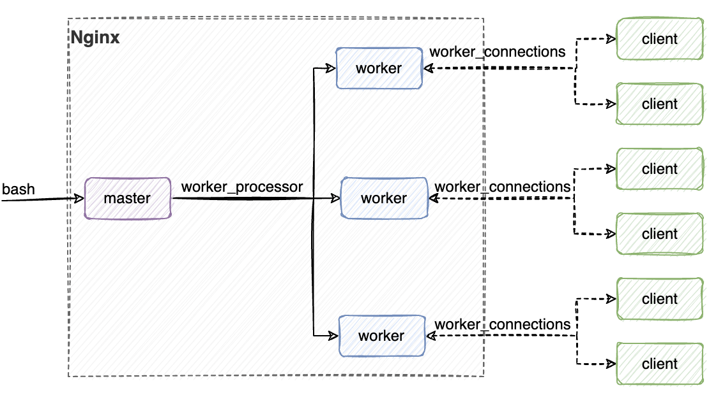

> `Nginx`是**以`daemon`多进程方式运行**的，包含一个`master`进程和可能多个的`worker`进程。
>
> - `master`进程：1）负责对外接收信号，并发送给`worker`进程去执行；2）管理`worker`进程，监控`worker`进程的状态，当一个`worker`进程由于异常原因退出时会重启启动一个`worker`进程
> - `worker`进程：具体处理网络请求，多个`worker`相互竞争请求。一个请求只能在一个`worker`进程中处理。

- 以`./nginx -s reload`指令为例，`Nginx`的**`master`和`worker`进程工作流程**如下：
  1. `master`进程对配置文件做语法检验；
  2. 如果语法校验没问题，则尝试应用当前配置文件；
  3. 若成功应用，则新建`worker`进程；
  4. 新建`worker`进程成功之后，`master`进程向旧`worker`进程发送退出指令；
  5. 旧`worker`进程在完全处理完当前请求之后，才会执行退出动作

- **`worker`进程处理`client`请求**的时候，多个`worker`之间的关系是同等的，会同时竞争请求处理，流程如下：
  1. `Nginx`在启动创建好`master`进程之后，会建立需要监听的`socket`；
  2. 之后所有的`worker`进程都会从`master`进程中`fork`出来。因此，所有的`worker`进程的监听描述符`listenfd`在新连接到来时都会变为可读；
  3. `Nginx`使用互斥锁来保证多个`worker`之间只有一个`worker`进程能够处理当前竞争的请求；
  4. 获取到互斥锁的`worker`进程注册`listenfd`读事件，在读事件中调用`accept`接收该连接，之后解析处理请求并返回给客户端
- `Nginx`设计多进程模型的好处：
  1. 每个`worker`进程都是独立的，进程在处理请求的时候不需要加锁，减少开销；
  2. 每个`worker`进程都是独立的，一个`worker`进程异常退出，不影响整体正常提供服务
