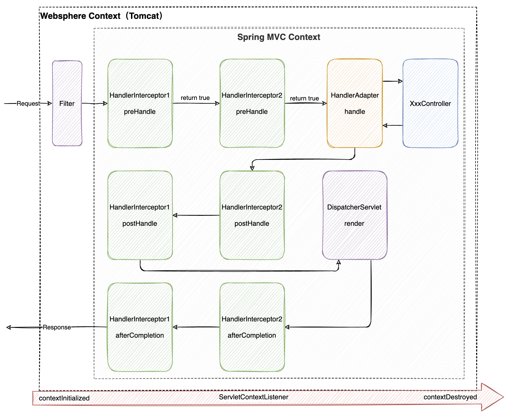

## Spring MVC 高级应用

### 一、监听器、过滤器和拦截器

#### 1.1 监听器

> 监听器具体表现为实现了**`javax.servlet.ServletContextListener`**接口的组件，这是一个**`JavaEE`的标准接口**，因此需要**配置在`web.xml`中**。

```java
public interface ServletContextListener extends EventListener {
	/**
	 ** 用于 web 容器初始化扩展
	 ** 比如用于在容器启动的时候，完成 Spring 上下文初始化工作（org.springframework.web.context.ContextLoaderListener）
	 */
    public void contextInitialized ( ServletContextEvent sce );

	/**
	 ** 用于 web 容器销毁扩展
	 */
    public void contextDestroyed ( ServletContextEvent sce );
}
```

#### 1.2 过滤器

> 过滤器具体表现为实现了**`javax.servlet.Filter`**接口的组件，这是一个**`JavaEE`**的标准接口，因此需要**配置在`web.xml`中**。

```java
public interface Filter {

	/** 
	* 此处扩展 Filter 初始化的配置
	*/
	public void init(FilterConfig filterConfig) throws ServletException;
	
	/**
	* 此处在请求进入 Servlet 之前，对配置的匹配路径的资源进行处理，包括：Servlet、js/html等静态资源。
	**/
    public void doFilter ( ServletRequest request, ServletResponse response, FilterChain chain ) throws IOException, ServletException;

	/**
	* 此处在请求走出 Servlet 之后，做一些销毁的扩展
	*/
	public void destroy();
}
```

#### 1.3 拦截器

> 拦截器具体表现为实现了**`org.springframework.web.servlet.HandlerInterceptor`**接口的组件，这是一个**`Spring MVC`提供的接口**，因此**不在`web.xml`中配置**，而是在`Spring MVC`上下文中配置。

```java
public interface HandlerInterceptor {

	/**
	 * 在 HandlerAdapter 执行请求逻辑之前执行
	 * 此处扩展点通常用于做权限校验，返回为 true 代表放行逻辑，返回为 false 代表中止逻辑
	 */
	default boolean preHandle(HttpServletRequest request, HttpServletResponse response, Object handler) throws Exception {
		return true;
	}

	/**
	 * 在 HandlerAdapter 执行请求逻辑之后执行
	 */
	default void postHandle(HttpServletRequest request, HttpServletResponse response, Object handler, @Nullable ModelAndView modelAndView) throws Exception {
	}

	/**
	 * 在 Servlet 完成视图渲染之后执行
	 */
	default void afterCompletion(HttpServletRequest request, HttpServletResponse response, Object handler, @Nullable Exception ex) throws Exception {
	}

}
```

拦截器使用只需要实现`HandlerInterceptor`这个接口，之后在`Spring MVC`上下文中对拦截器进行注册，此外还可以添加拦截规则灵活实现请求拦截处理。

```java
public class TestInterceptor01 implements HandlerInterceptor {
    @Override
    public boolean preHandle(HttpServletRequest request, HttpServletResponse response, Object handler) throws Exception {
        System.out.println("TestInterceptor01 preHandle...");
        return true;
    }

    @Override
    public void postHandle(HttpServletRequest request, HttpServletResponse response, Object handler, ModelAndView modelAndView) throws Exception {
        System.out.println("TestInterceptor01 postHandle...");
    }

    @Override
    public void afterCompletion(HttpServletRequest request, HttpServletResponse response, Object handler, Exception ex) throws Exception {
        System.out.println("TestInterceptor01 afterCompletion...");
    }
}
```

```xml
<!-- 配置拦截器 -->
<mvc:interceptors>
    <mvc:interceptor>
        <mvc:mapping path="/demo/**"/>
        <bean class="cloud.yiwenup.sample.webmvc.interceptor.TestInterceptor01"/>
    </mvc:interceptor>
    <mvc:interceptor>
        <mvc:mapping path="/**"/>
        <bean class="cloud.yiwenup.sample.webmvc.interceptor.TestInterceptor02"/>
    </mvc:interceptor>
</mvc:interceptors>
```


#### 1.4 三者关系



如上图所示：

- 首先请求进来会经过`Filter`过滤器，完成资源处理；
- 之后进入拦截器`HandlerInterceptor`的`preHandle`方法，执行逻辑前拦截处理；
- 当`preHandle`方法返回`true`，请求继续放行，由`HandlerAdapter`调度具体`XxxController`执行具体逻辑，并返回`ModelAndView`；
- 逻辑处理之后，调用链路继续来到`HandlerInterceptor`的`postHandle`方法；
- 接着`DispatcherServlet`执行页面渲染；
- 最终`HandlerInterceptor`的`afterCompletion`处理结束后，响应客户端；
- 整个过程，`ServletContextListener`会在容器初始化之初执行一次`contextInitialized`，在容器销毁执行一次`contextDestroyed`方法。
- 若有多个`HandlerInterceptor`，则按注册顺序，首先执行`HI1#preHandle`，再执行`HI2#preHandle`，先执行`HI2#postHandle`，再执行`HI1#postHandle`，先执行`HI2#afterCompletion`，再执行`HI1#afterCompletion`。

### 二、Multipart 文件上传

1. 添加依赖`commons-fileupload`

   ```xml
   <!-- 文件上传 -->
   <dependency>
       <groupId>commons-fileupload</groupId>
       <artifactId>commons-fileupload</artifactId>
       <version>1.5</version>
   </dependency>
   ```

2. 前端`form`表单实现文件上传，需要注意**请求方式为`POST`，`enctype`为`multipart/form-data`**

   ```jsp
   <form method="post" enctype="multipart/form-data" action="${pageContext.request.contextPath}/demo/upload">
       <input type="file" name="uploadFile"/>
       <input type="submit" value="上传"/>
   </form>
   ```

3. 后端参数接收使用`org.springframework.web.multipart.MultipartFile`类型

   ```java
   @RequestMapping(value = "/upload")
   public String upload(MultipartFile uploadFile, HttpServletRequest request) throws IOException {
       String originalFilename = uploadFile.getOriginalFilename();
       assert originalFilename != null;
       String suffix = originalFilename.substring(originalFilename.lastIndexOf("."));
       String newName = UUID.randomUUID() + suffix;
       String realPath = request.getServletContext().getRealPath("/uploads");
       String date = new SimpleDateFormat("yyyy-MM-dd").format(new Date());
       File dir = new File(realPath + "/" + date);
       if (!dir.exists()) {
           dir.mkdirs();
       }
       uploadFile.transferTo(new File(dir, newName));
       return "success";
   }
   ```

4. 为`Spring MVC`上下文配置文件解析器`org.springframework.web.multipart.commons.CommonsMultipartResolver`，该类是`MultipartResolver`的实现，需要注意该**`bean`的`id`需要指定也只能是`multipartResolver`**。

   ```xml
   <!-- 配置文件解析器 -->
   <bean id="multipartResolver" class="org.springframework.web.multipart.commons.CommonsMultipartResolver">
       <property name="maxUploadSize" value="500000"/>
   </bean>
   ```

### 三、异常处理

> 对于`Controller`抛出的业务异常，可以使用`@ExceptionHandler`定义异常处理方法，用于接收并统一处理这些异常。

```java
/**
 * 示例异常处理
 */
@ExceptionHandler(NullPointerException.class)
public String exception(Exception ex) {
    System.out.println("error" + ex.getMessage());
    return "error";
}
```

若上述代码段定义在某个`Controller`中，则只能处理当前`Controller`中抛出的异常，对于其他的`Controller`方法抛出的异常则无法统一捕获处理，因此需要借助`@ControlelrAdvice`定义全局异常处理增强逻辑。

```java
@ControllerAdvice
public class GlobalExceptionHandler {
    @ExceptionHandler(Exception.class)
    public String exception(Exception ex) {
        System.out.println("error: " + ex.getMessage());
        return "error";
    }
}
```

### 四、转发与重定向

> **转发与重定向都是`Servlet`实现页面跳转的方式。**

- 重定向：
  - 对于浏览器来说是**两次请求**，由第一次请求后服务器返回跳转规则，浏览器根据规则发起第二次请求；
  - **携带的参数将会丢失**；
  - 浏览器地址栏会发生变化。
- 转发：
  - 对于浏览器来说是**一次请求**，由服务器内部处理跳转规则，浏览器并不知道内部的规则；
  - **携带的参数不会丢失**；
  - 浏览器的地址栏不会发生变化。

```java
@RequestMapping(value = "/redirect")
public String redirect(HttpServletRequest request, HttpServletResponse response) throws Exception {
    // 转发需要补充上下文根路径，否则浏览器请求404
    // response.sendRedirect(request.getContextPath() + "/demo/receive");
    
    // 这种写法不需要补充上下文根路径
    return "redirect:/demo/receive";
}

@RequestMapping(value = "/forward")
public String forward(HttpServletRequest request, HttpServletResponse response) throws Exception {
    // 转发不需要添加上下文根路径，因为此时是服务器内部行为
    request.getRequestDispatcher("/demo/receive").forward(request, response);
    return "success";
}

@RequestMapping(value = "/receive")
public String receive(String uname) {
    System.out.println(uname);
    return "success";
}
```

针对重定向会丢失参数这个问题，**可以在重定向的路径上手动拼接上参数，但是存在安全性问题，并且也受浏览器参数长度限制**。而`Spring MVC`提供的`RedirectAttributes`则帮助我们很好的解决了这个问题，**原理是请求时会在上下文中添加`flashAttribute`，框架会在`session`中记录属性值，在成功跳转之后会自动删除该值**。

`RedirectAttributes`使用要特别注意：一是**使用`redirect:/xxx`的方式跳转**，不能返回视图名称；二是跳转目标**接收参数只能使用`ModelMap`或者`@ModelAttribute`**。

```java
@RequestMapping(value = "/redirect")
public String redirect(HttpServletRequest request, HttpServletResponse response, RedirectAttributes redirectAttributes) throws Exception {
    redirectAttributes.addFlashAttribute("uname", request.getParameter("uname"));
    return "redirect:/demo/receive";
}

@RequestMapping(value = "/receive")
public String receive(ModelMap map) {
    System.out.println(map.get("uname"));
    return "success";
}
```

