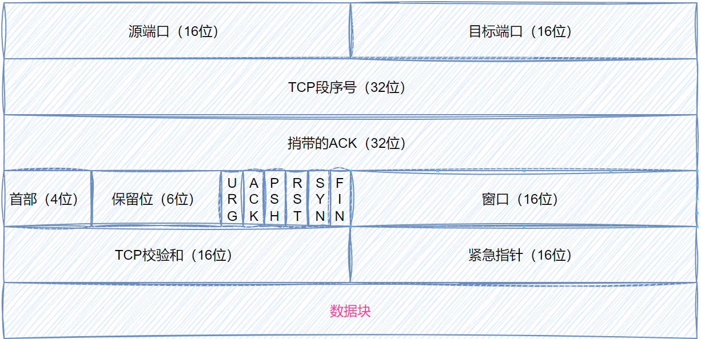

## 一、传输原理

> `TCP`是一种端到端的传输协议，通过“发送-应答”机制来保证传输的可靠性。
>
> `TCP`的传输是分段的，一个`HTTP`请求报文会被操作系统切成多个`MSS（Maximum Segment Size）`大小的段，直到接收端接受到完整的报文为止。在此过程中，报文分段按照顺序进行发送，每个报文段在发送时，会做顺序编号，以便能够完整正确地组装。

- `TCP`的数据是通过名为`IP`分组（ 或`IP`数据包） 的小数据块来发送的。`HTTP`就是`HTTP over TCP over IP `这个协议栈中的最顶层。
- `HTTP`要传送一条报文时，会以流的形式将报文数据的内容通过一条打开的`TCP`连接按序传输。`TCP`收到数据流之后，会将数据流砍成被称作**`TCP`段**的小数据块，并将段封装在`IP`分组中， 通过网络进行传输。 
- 每个`TCP`段都是由`IP`分组承载， 从一个`IP`地址发送到另一个`IP`地址，每个`IP`分组中都包括一个`IP`分组首部（通常为 20 字节）、一个`TCP`段首部（通常为 20 字节）和一个`TCP`数据块（0 个或多个字节）
- 在`TCP/IP`中就能明确的标识出发送端和接收端的`IP`和`port`，这四个值就能明确唯一一条连接

## 二、滑动窗口协议

> 在上述`TCP`段的示意图中，其中有`16`位用于表示窗口，就是用于滑动窗口协议。
>
> 由于`TCP`在传输过程中相对`UDP`协议而言，是需要保证传输数据的质量的，这里需要提到两个关键的功能：
>
> - **可靠性**：保证数据确实到达目的地。如果未到达，能够发现并重传。
> - **数据流控**：管理数据的发送速率，以使接收设备不致于过载。
>
> 要达到上述两点要求，`TCP`协议是围绕**滑动窗口确认机制**来进行的。

滑动窗口协议是`TCP`协议的一种应用，用于网络数据传输时的流量控制，以避免拥塞的发生。该协议允许发送方在停止并等待确认前发送多个数据分组。由于发送方不必每发一个分组就停下来等待确认。因此该协议可以加速数据的传输，提高网络吞吐量。

如果我们在任一时间点对于这一过程做一个“快照”，那么我们可以将`TCP buffer`中的数据分为以下四类，并把它们看作一个时间轴：

其中：

- **已发送已`ACK`**：数据流中最早的字节已经发送并得到确认。这些数据是站在发送设备的角度来看的。
- **已发送但尚未`ACK`**：已发送但尚未得到确认的字节。发送方在确认之前，不认为这些数据已经被处理。
- **未发送而接收方已`Ready`**：设备尚未将数据发出，但接收方根据最近一次关于发送方一次要发送多少字节确认自己有足够空间。发送方会立即尝试发送。
- **未发送而接收方`Not Ready`**：由于接收方`not ready`，还不允许将这部分数据发出。

那么在正常运作的情况下，每当一个数据包被`ACK`，那么窗口就会向后移动一格，将后续一格的数据包载入缓存等待发送，整体窗口内的数据包状态会被重置一次，最终形成 1-4 数据包为绿色，5-7 数据包为蓝色，8-10 数据包为红色。

### 2.1 超时重发/重传

> 在滑动窗口协议的作用下，如果出现作为发送方迟迟没有收到对方`ACK`的情况，那么我们认为传输**丢包**了。
>
> 丢包就会导致发送方一直在等待对方`ACK`，此时发送方会持续将窗口内其余状态的数据包陆续读到缓存中，形成已发送而未`ACK`，直到把整个窗口大小都撑满。
>
> 

超时重发/重传原理是在发送某一个数据以后就开启一个计时器，在一定时间内如果没有得到发送的数据报的ACK报文，那么就重新发送数据，直到发送成功为止。

影响超时重传机制的一个关键参数是重传超时时间`（RTO，Retransmission TimeOut）`。`RTO`的值被设置过大过小都会对协议造成不利影响：

- `RTO`设长了，重发就慢，没有效率，性能差
- `RTO`设短了，重发的就快，会增加网络拥塞，导致更多的超时，更多的超时导致更多的重发

在`Unix`以及`Windows`系统中，最初其重发超时的默认值一般设置为`6`秒（重发时间必须是`0.5`秒的倍数）左右。数据被重发之后若还是收不到确认应答，则进行再次发送。此时，等待确认应答的时间将会以`2`倍、`4`倍的指数函数延长。

此外，数据也不会被无限、反复地重发。达到一定重发次数之后，如果仍没有任何确认应答返回，就会判断为网络或对端主机发生了异常，强制关闭连接，并且通知应用通信异常强行终止。
