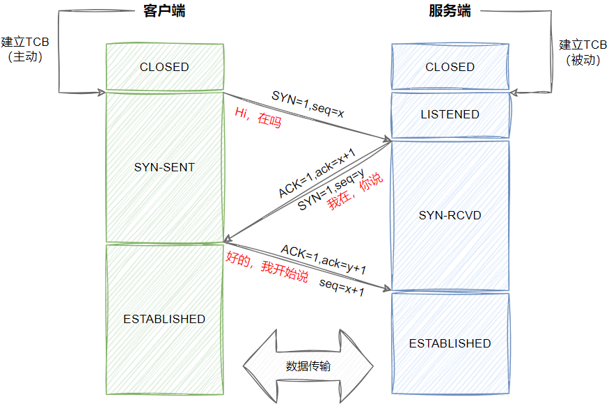

> HTTP 通信由 TCP/IP 承载的， TCP/IP 是全球计算机及网络设备都在使用的一种常用的分组交换网络分层协议集。客户端应用程序可以打开一条 TCP/IP 连接，连接到可能运行在世界任何地方的服务器应用程序。一旦连接建立，在客户端和服务器的计算机之间交换的报文就永远不会丢失、 受损或失序。

## 一、三次握手

> TCP协议目的是为了保证数据能在两端准确连续的流动，TCP 用一种叫做 **TCB（传输控制块）**的数据结构，把发给不同设备的数据封装起来，一个 TCB 数据块包含了数据发送双方对应的socket信息以及拥有装载数据的缓冲区。在两个设备要建立连接发送数据之前，双方都必须要做一些准备工作，分配内存建立起TCB数据块就是连接建立前必须要做的准备工作。

0. **准备工作：**最开始的时候客户端和服务器都是处于CLOSED状态。主动打开连接的为客户端，被动打开连接的是服务器。TCP服务器进程先创建传输控制块 TCB，时刻准备接受客户进程的连接请求，此时服务器就进入了 LISTEN（监听）状态。
1. **第一次握手：**TCP 客户端进程先创建传输控制块TCB，然后向服务器发出连接请求报文，SYN=1 是报文首部中的同部位，同时选择一个初始序列号 seq=x 。此时，TCP客户端进程进入了 SYN-SENT（同步已发送状态）状态。
2. **第二次握手：**TCP 服务器收到请求报文后，如果同意连接，则发出确认报文。确认报文中应该 ACK=1，SYN=1，确认号是 ack=x+1，同时也要为自己初始化一个序列号 seq=y，此时，TCP 服务器进程进入了 SYN-RCVD（同步收到）状态。
3. **第三次握手：**TCP客户进程收到确认后，还要向服务器给出确认。确认报文的 ACK=1，ack=y+1，自己的序列号 seq=x+1，此时，TCP连接建立，客户端进入 ESTABLISHED（已建立连接）状态。当服务器收到客户端的确认后也进入established状态，此后双方就可以开始通信了。

### 1.1 三次握手的必要性

**简言之，三次握手就是为了保证客户端和服务端都能明确双方的收发能力正常。**

- 在**第一次握手**中，客户端向服务端发送网络包，服务端收到。**服务端视角判定：客户端发送能力、服务端接收能力正常**；
- 在**第二次握手**中，服务端向客户端发送网络包，客户端收到。**客户端视角判定：客户端收/发能力、服务端收/发能力正常**；
- 在**第三次握手**中，客户端向服务端发送网络包，服务端收到。**服务端视角判定：客户端收/发能力正常、服务端收/发能力正常**；
- 最终才能实现客户端、服务端之间的信息对称，都能判断出双方的收/发能力正常，之后就可以开始正常的通信了。

### 1.2 第三次握手的必要性

除了在三次握手中，通过客户端、服务端视角来看待第三次握手，目的是为了让服务端也能判断出双方的收发能力正常。还能从反面论证第三次`ACK`的必要性。

假设当客户端第一次发起`SYN`网络包的时候，由于网络波动导致第一次请求没有到达服务端。在客户端看来是迟迟没有收到服务端的第二次`ACK`包，于是客户端会再次尝试给服务端发送一次`SYN`包，此时服务端接收到并成功`ACK`到客户端，如果在没有第三次握手的情况下，那么此时网络连接就会被建立。但是等到第一次`SYN`的数据包滞留一段时间又到达服务端时，服务端又会处理该请求并`ACK`到客户端，客户端和服务端之间则又会建立一次网络连接，此时会产生错误或者导致不必要的资源浪费。

因此第三次握手就是为了防止由于网络原因产生的失效请求报文又到达服务端，导致服务端和客户端产生错误的网络连接。

## 二、四次挥手

> 数据传输完毕后，双方都可释放连接。最开始的时候，客户端和服务器都是处于 established（表示连接已经建立）状态，然后客户端主动关闭，服务器被动关闭。

1. 第一次挥手：客户端进程发出连接释放报文，并且停止发送数据。释放数据报文首部，FIN=1（FIN表示关闭连接，SYN表示建立连接），其序列号为seq=u（等于前面已经传送过来的数据的最后一个字节的序号加1）。此时，客户端进入 FIN-WAIT-1（终止等待1）状态。
2. 第二次挥手：服务器收到连接释放报文，发出确认报文，ACK=1，ack=u+1（确认序号为收到的序号加1），并且带上自己的序列号seq=v，此时，服务端就进入了 CLOSE-WAIT（关闭等待）状态。TCP 服务器通知高层的应用进程，客户端向服务器的方向就释放了，这时候处于半关闭状态，即客户端已经没有数据要发送了，但是服务器若发送数据，客户端依然要接受。这个状态还要持续一段时间，也就是整个CLOSE-WAIT状态持续的时间。
3. 第三次挥手：客户端收到服务器的确认请求后，此时，客户端就进入FIN-WAIT-2（终止等待2）状态，等待服务器发送连接释放报文（在这之前还需要接受服务器发送的最后的数据）。
4. 第四次挥手：服务器将最后的数据发送完毕后，就向客户端发送连接释放报文，FIN=1，ack=u+1，由于在半关闭状态，服务器很可能又发送了一些数据，假定此时的序列号为seq=w，此时，服务器就进入了LAST-ACK（最后确认）状态，等待客户端的确认。
5. 客户端收到服务器的连接释放报文后，必须发出确认，ACK=1，ack=w+1，而自己的序列号是seq=u+1，此时，客户端就进入了TIME-WAIT（时间等待）状态。注意此时TCP连接还没有释放，必须经过2*MSL（最长报文段寿命）的时间后，当客户端撤销相应的TCB后，才进入CLOSED状态。
6. 服务器只要收到了客户端发出的确认，立即进入 CLOSED 状态。同样，撤销 TCB 后，就结束了这次的 TCP 连接。可以看到，服务器结束 TCP 连接的时间要比客户端早一些。

### 3.1 最后2MSL的意图

> `MSL（Maximum Segment Lifetime）`表示消息的最大存活时间。

之所以是`2MSL`是因为**`2MSL`= 客户端去向`ACK`消息的最大存活时间 + 来向`FIN`消息的最大存活时间**。有以下作用：

- **保证客户端的最后一次`ACK`报文总是能够到达服务端。**假设客户端的最后一次`ACK`报文由于网络问题滞留了，此时服务端会在发送`FIN+ACK`报文却没有收到客户端的`ACK`报文情况下，再次向客户端重发`FIN+ACK`报文。此时在客户端的`2MSL`机制之上，能保证服务端的重发报文仍然能够到达客户端，让客户端再次发送`ACK`报文。
- **保证客户端能够安全的占用网络资源。**假设客户端没有等待`2MSL`的时间而是直接释放资源，此时很有可能客户端又需要和服务端再次建立通信，那么之前在途的报文就会和此次建立连接时新发的报文产生数据冲突。所以`2ML`能够给客户端和服务端之间留充足的时间将之前活跃的报文等待完毕。

### 3.2 TCP的保活机制

**`TCP`的保活机制主要是作用在服务端，解决在连接建立之后，客户端突然故障，避免占用服务端资源的问题。**服务端会在每次接受到客户端请求之后都复位一个计时器（通常设置的时间是 2 小时）。如果在计时器到点还没有接受到客户端请求时，服务端会每隔 75 秒发送一次探活报文，连发 10 次如果客户端都没有响应，那么服务端就会认为这个客户端故障了，需要断开连接。

### 3.3 握手三次与挥手四次

`TCP`建立连接需要三次握手，而释放连接则需要四次。其实在释放连接中多出来的一次是做以下设计考虑：服务器收到对方的FIN报文时，仅仅表示对方不再发送数据了但是还能接收数据，而**自己也未必已经将全部数据都发送给对方**了，所以己方可以立即关闭，也可以发送一些数据给对方后，再发送FIN报文给对方来表示同意现在关闭连接，因此，己方ACK和FIN一般都会分开发送，从而导致多了一次。

## 三、TCP协议的缺陷

`TCP`协议的缺陷主要表现在三次握手的第一次握手中，容易被利用作为`DDOS（Distributed Denial of Service）`攻击漏洞，大致思路或者原理如下：

1. 首先伪造大量的源IP地址，分别向服务器端发送大量的SYN包
2. 服务器端返回SYN/ACK包，因为源地址是伪造的，所以伪造的IP并不会应答
3. 服务器端没有收到伪造IP的回应，会重试3~5次并且等待一个SYN Time（—般为30秒至2分钟），如果超时则丢弃这个连接
4. 攻击者大量发送这种伪造源地址的SYN请求，服务器端将会消耗非常多的资源来处理这种半连接，同时还要不断地对这些IP进行SYN+ACK重试
5. 最后的结果是服务器无暇理睬正常的连接请求，导致拒绝服务

