## 一、搭建源码调试环境

1. 下载源码包至目标目录后，新建`resources`目录（该目录名称可以随意取），将源码包下的`conf`和`webapps`目录放在`resources`目录下。

   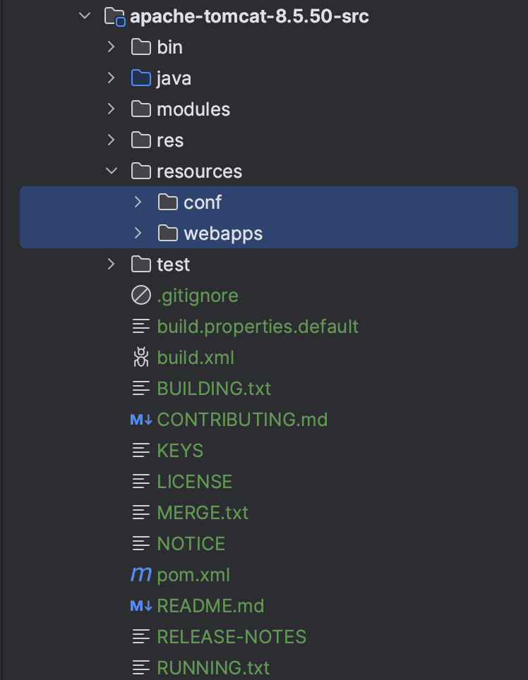

2. 在源码包根目录下新建`pom.xml`文件，后续使用`maven`进行依赖管理。

   ```xml
   <?xml version="1.0" encoding="UTF-8"?>
   <project xmlns="http://maven.apache.org/POM/4.0.0"
            xmlns:xsi="http://www.w3.org/2001/XMLSchema-instance"
            xsi:schemaLocation="http://maven.apache.org/POM/4.0.0 http://maven.apache.org/xsd/maven-4.0.0.xsd">
       <modelVersion>4.0.0</modelVersion>
   
       <groupId>org.apache.tomcat</groupId>
       <artifactId>apache-tomcat-8.5.50-src</artifactId>
       <version>8.5.50</version>
   
       <name>Tomcat8.5</name>
   
       <dependencies>
           <dependency>
               <groupId>org.easymock</groupId>
               <artifactId>easymock</artifactId>
               <version>3.4</version>
           </dependency>
           <dependency>
               <groupId>ant</groupId>
               <artifactId>ant</artifactId>
               <version>1.7.0</version>
           </dependency>
           <dependency>
               <groupId>wsdl4j</groupId>
               <artifactId>wsdl4j</artifactId>
               <version>1.6.2</version>
           </dependency>
           <dependency>
               <groupId>javax.xml</groupId>
               <artifactId>jaxrpc</artifactId>
               <version>1.1</version>
           </dependency>
           <dependency>
               <groupId>org.eclipse.jdt.core.compiler</groupId>
               <artifactId>ecj</artifactId>
               <version>4.5.1</version>
           </dependency>
           <dependency>
               <groupId>javax.xml.soap</groupId>
               <artifactId>javax.xml.soap-api</artifactId>
               <version>1.4.0</version>
           </dependency>
       </dependencies>
   
       <build>
           <finalName>Tomcat8.5</finalName>
           <sourceDirectory>java</sourceDirectory>
           <resources>
               <resource>
                   <directory>java</directory>
               </resource>
           </resources>
           <plugins>
               <plugin>
                   <groupId>org.apache.maven.plugins</groupId>
                   <artifactId>maven-compiler-plugin</artifactId>
                   <version>3.1</version>
                   <configuration>
                       <encoding>UTF-8</encoding>
                       <source>17</source>
                       <target>17</target>
                   </configuration>
               </plugin>
           </plugins>
       </build>
   
   </project>
   ```

3. 新建本地`Tomcat`启动`JVM`参数，主要是指定一些配置路径。

   ```bash
   -Dcatalina.home=/Users/yiwenup/resource/yiwenup-sample/yiwenup-sample-tomcat/apache-tomcat-8.5.50-src/resources
   -Dcatalina.base=/Users/yiwenup/resource/yiwenup-sample/yiwenup-sample-tomcat/apache-tomcat-8.5.50-src/resources
   -Djava.util.logging.manager=org.apache.juli.ClassLoaderLogManager
   -Djava.util.logging.config.file=/Users/yiwenup/resource/yiwenup-sample/yiwenup-sample-tomcat/apache-tomcat-8.5.50-src/resources/conf/logging.properties
   ```

4. 找到`org.apache.catalina.startup.Bootstrap#main`方法尝试启动工程，如果有缺失依赖再进一步引入即可。正常情况下启动应该没问题，但是访问会出现`JSP`解析异常问题。

   

   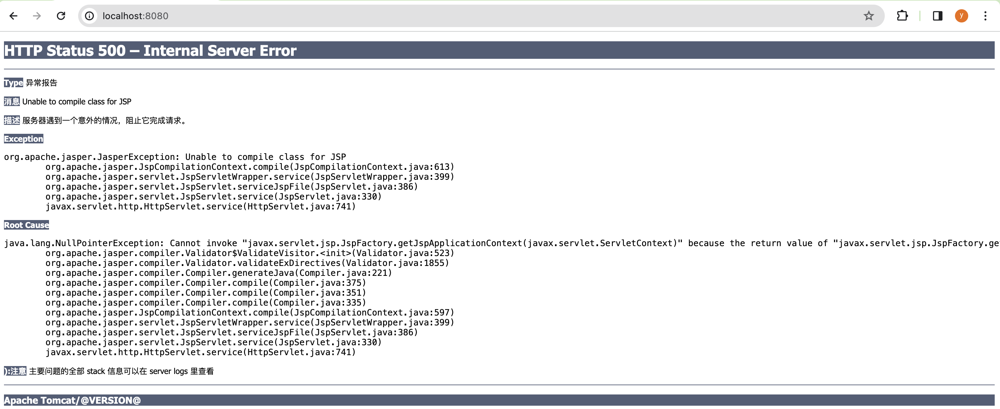

5. 出现`JSP`解析异常问题，原因是没有初始化`Jasper`引擎，需要在源码`org.apache.catalina.startup.ContextConfig#configureStart`方法进行调整，加入以下代码。

   ```java
   // 初始化JSP引擎Jasper
   context.addServletContainerInitializer(new JasperInitializer(), null);
   ```

6. 至此，本地`Tomcat`源码调试环境搭建完成。

   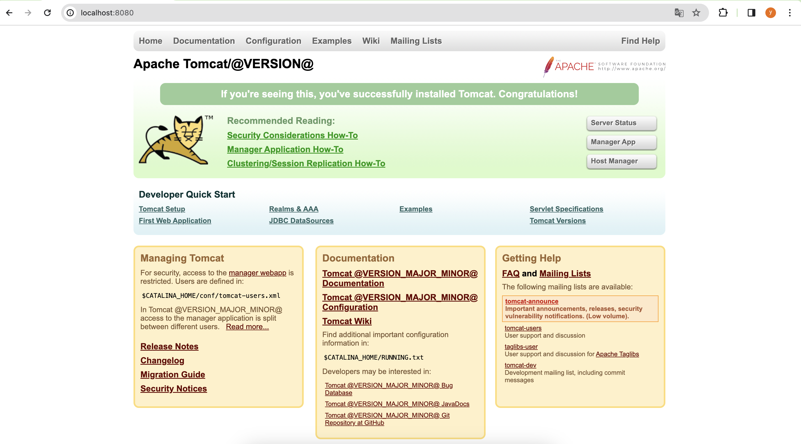

## 二、启动流程

### 2.1 生命周期与容器抽象

> 在学习`Tomcat`启动流程之前，我们需要了解`Tomcat`在启动流程中会涉及到的一些核心类，以及他们的作用。

1. **Lifecycle 和 LifecycleBase**

   - `Lifecycle`用于抽象`Tomcat`内部组件的生命周期，在接口中主要声明了`init`、`start`、`stop`和`destroy`几个生命周期。

   - `LifecycleBase`实现了`Lifecycle`，并基于`init`、`start`、`stop`和`destroy`生命周期进行了基础实现，主要体现在各方法处理状态转换的细节。对各子类具体组件的实现提供了`xxxInternal`方法便于扩展。

2. **Container 和 ContainerBase**

   - `Container`继承了`Lifecycle`的功能，并在此基础上支持来自客户端请求的处理能力并响应结果。
   - `ContainerBase`实现了`Container`接口，提供了一些抽象方法的默认实现，并开放子类可扩展点。

3. **Digester**

   - `Tomcat`基于是此工具实现`server.xml`解析的

### 2.2 主要启动流程

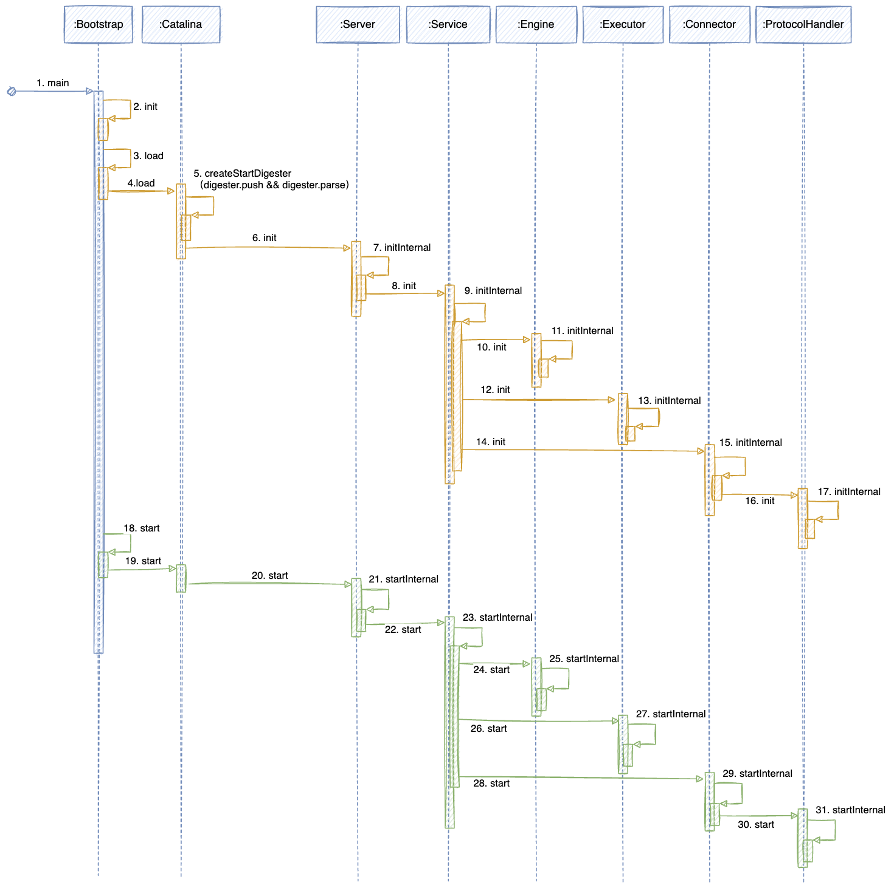

- `Tomcat`接受客户端启动脚本`startup.bat/startup.sh`命令，引导`org.apache.catalina.startup.Bootstrap#main`启动
- `org.apache.catalina.startup.Bootstrap#main`方法调用执行`org.apache.catalina.startup.Bootstrap#init`进行**类加载器初始化**
- `org.apache.catalina.startup.Bootstrap#load`方法反射调用`org.apache.catalina.startup.Catalina#load`准备初始化内部组件，其中会先使用`org.apache.tomcat.util.digester.Digester#parse(org.xml.sax.InputSource)`读取`server.xml`配置文件，**预先实例化Server等组件对象**
- `org.apache.catalina.startup.Catalina#load`调用`org.apache.catalina.util.LifecycleBase#init`方法，通过扩展点继续调用`org.apache.catalina.core.StandardServer#initInternal`**初始化Server组件**
- `org.apache.catalina.core.StandardServer#initInternal`调用`org.apache.catalina.util.LifecycleBase#init`方法，通过扩展点继续调用`org.apache.catalina.core.StandardService#initInternal`**初始化Service组件**
- `org.apache.catalina.core.StandardService#initInternal`调用`org.apache.catalina.util.LifecycleBase#init`方法，通过扩展点继续调用`org.apache.catalina.core.StandardEngine#initInternal`**初始化Engine组件**
- `org.apache.catalina.core.StandardService#initInternal`调用`org.apache.catalina.util.LifecycleBase#init`方法，通过扩展点继续调用`org.apache.catalina.core.StandardThreadExecutor#initInternal`**初始化Executor组件**
- `org.apache.catalina.core.StandardService#initInternal`调用`org.apache.catalina.util.LifecycleBase#init`方法，通过扩展点继续调用`org.apache.catalina.connector.Connector#initInternal`**初始化Connector组件**
- `org.apache.catalina.connector.Connector#initInternal`调用`org.apache.coyote.AbstractProtocol#init`方法**初始化ProtocolHandler组件**
- 到上述为止，`Tomcat`内部核心组件实例化并初始化完成
- `org.apache.catalina.startup.Bootstrap#start`方法反射调用`org.apache.catalina.startup.Catalina#load`准备启动内部组件
- `org.apache.catalina.startup.Catalina#start`调用`org.apache.catalina.util.LifecycleBase#start`方法，通过扩展点继续调用`org.apache.catalina.core.StandardServer#startInternal`**启动Server组件**
- `org.apache.catalina.core.StandardServer#startInternal`调用`org.apache.catalina.util.LifecycleBase#start`方法，通过扩展点继续调用`org.apache.catalina.core.StandardService#startInternal`**启动Service组件**
- `org.apache.catalina.core.StandardService#startInternal`调用`org.apache.catalina.util.LifecycleBase#start`方法，通过扩展点继续调用`org.apache.catalina.core.StandardEngine#startInternal`**启动Engine组件**
- `org.apache.catalina.core.StandardService#startInternal`调用`org.apache.catalina.util.LifecycleBase#start`方法，通过扩展点继续调用`org.apache.catalina.core.StandardThreadExecutor#startInternal`**启动Executor组件**
- `org.apache.catalina.core.StandardService#startInternal`调用`org.apache.catalina.util.LifecycleBase#start`方法，通过扩展点继续调用`org.apache.catalina.connector.Connector#startInternal`**启动Connector组件**
- `org.apache.catalina.connector.Connector#startInternal`调用`org.apache.coyote.AbstractProtocol#start`方法**启动ProtocolHandler组件**

## 三、请求处理流程

### 3.1 Mapper 组件机制

> 当`Tomcat`接收到一个诸如：http://localhost:8080/app_context/user/getUser 请求时，考虑如何**将URL与虚拟主机、应用上下文、Servlet请求路径**做到映射关系建立的。此处便是使用了**Mapper组件**实现的:
>
> - `org.apache.catalina.mapper.Mapper`
> - `org.apache.catalina.mapper.Mapper.MapElement`
> - `org.apache.catalina.mapper.Mapper.MappedHost`
> - `org.apache.catalina.mapper.Mapper.MappedContext`
> - `org.apache.catalina.mapper.Mapper.MappedWrapper`

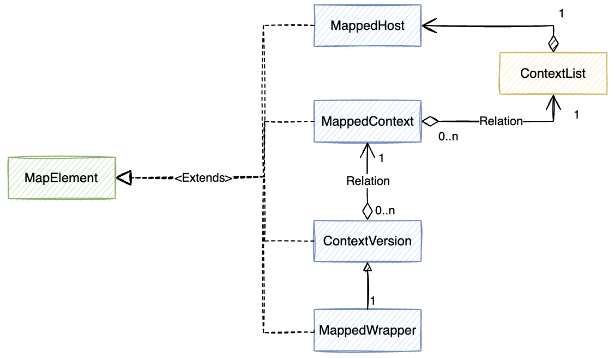

- MapElement：抽象映射组件元素，规范后续子类至少拥有`name`和`object`两个要素

  

- MappedHost：继承`MapElement`，用于映射`Engine`节点下的`Host`组件，其中组合了`ContextList`

  

- ContextList：用于包装`MappedContext`列表

  

- MappedContext：继承`MapElement`，其中组合了`ContextVersion`

  

- ContextVersion：继承`MapElement`，映射`Host`节点下的`Context`组件，用于组合`MappedWrapper`，方便精确查询、模糊查询、扩展匹配等方式查询`MappedWrapper`

  

- MappedWrapper：继承`MapElement`，用于映射web资源

  

### 3.2 请求接收流程

> 这一小节我们探索一下`Tomcat`是怎样接收到一个 HTTP 请求，并最终转化成`Tomcat`内部的`Request`和`Response`对象的


- 【线程准备】在`Tomcat`启动流程中会引导一系列组件执行`startInternal`方法，`NioEndpoint`组件就是在这个流程中完成启动的，在`NioEndpoint`组件启动过程中会创建`Acceptor`和`Poller`两个组件，两者都是`Runnable`线程，前者用于监听和接收网络请求，后者用于从`I/O`中获取请求并具体处理

- 当请求来临的时候，首先会被`Acceptor`监听，调用`countUpOrAwaitConnection`方法判断是否达到了`Tomcat`最大连接数，如果达到了则等待处理

- 之后`Acceptor`组件调用`setSocketOptions`方法对原生的`java.nio.channels.SocketChannel`组件进行装配，包装为`org.apache.tomcat.util.net.NioChannel`，最终注册给`Poller`组件

- `Acceptor`调用`register`向`Poller`注册了`NioChannel`，`Poller`再调用`wakeup`方法通知`Selector`准备处理请求事件

  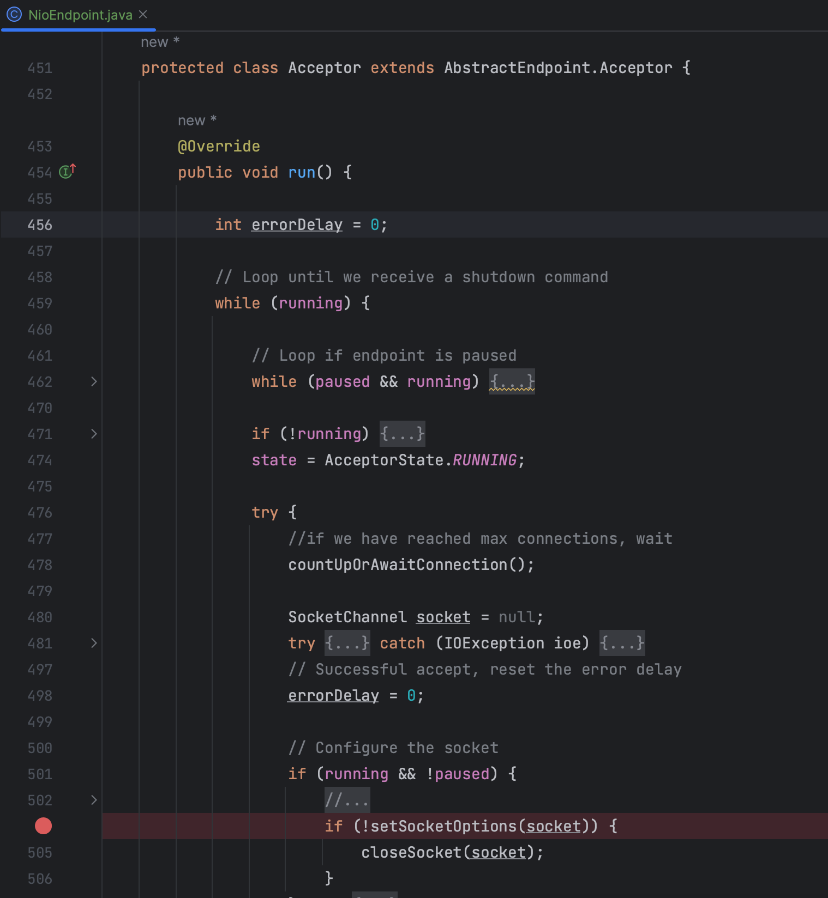

  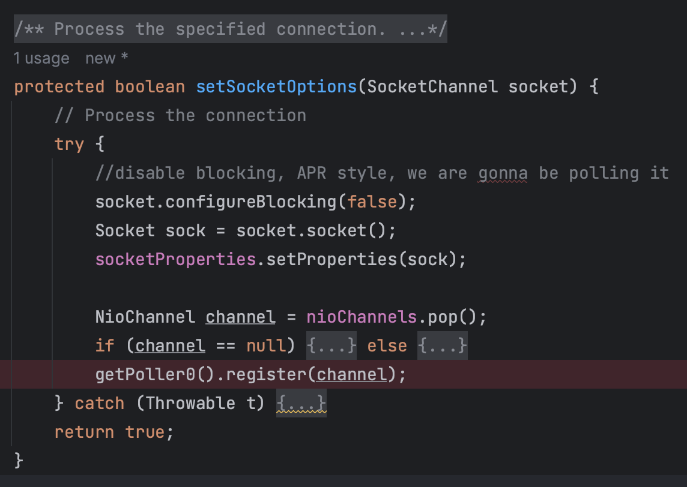

  

- `Poller`线程在后台通过调用`Selector`的`select`方法轮询请求事件，将事件数量统计为`keyCount`。当`keyCount`大于`0`的时候，调用`Selector`的`selectedKeys`获取可迭代的`Iterator<SelectionKey>`准备处理事件。遍历`Iterator<SelectionKey>`，对每一个元素使用`processKey`方法处理

  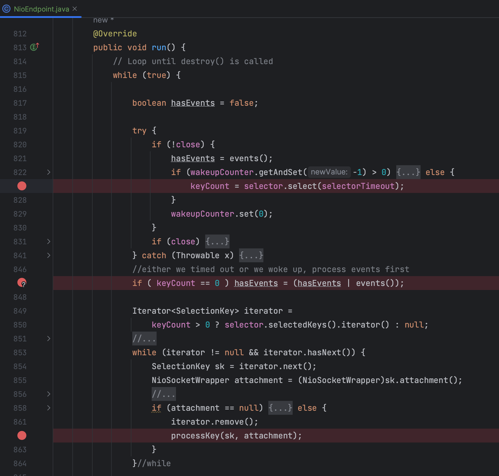

- `processKey`会调用具体`Endpoint`的`processSocket`方法，为每一个事件都封装一个`SocketProcessor`，最终将这个对象提交到`Executor`线程池中异步处理

  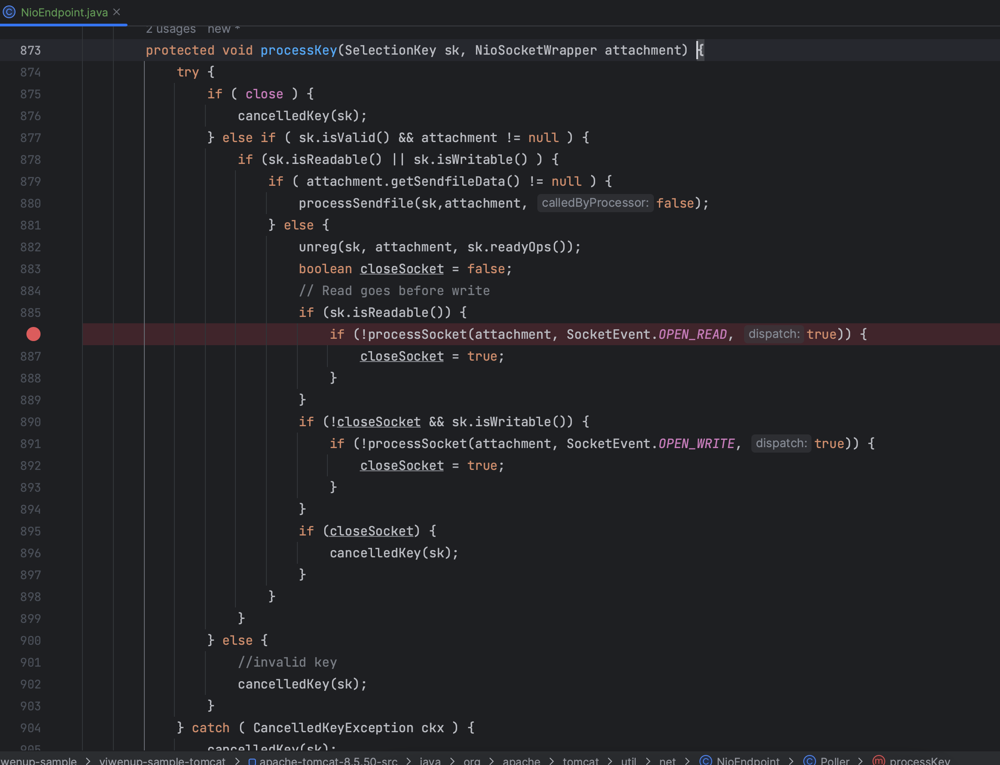

  

- `SocketProcessor`实际会执行`doRun`方法，确认握手成功后，获取`ConnectionHandler`并调用`process`方法

  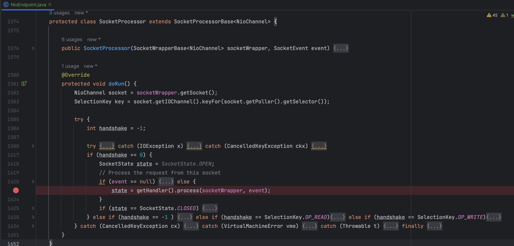

- `ConnectionHandler`通过匹配对应的`Processor`（比如`Http11Processor`）后，调用对方的`process`方法执行

  

- `Processor`将准备好的`socket`封装通过自己的`service`方法调用到`CoyoteAdapter`的`service`方法

  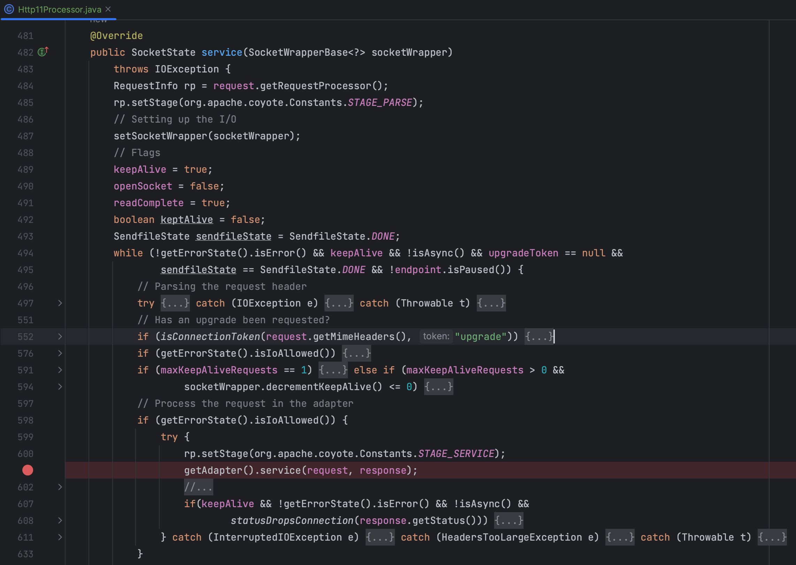

- `CoyoteAdapter`主要是准备好原生的`org.apache.coyote.Request`和`org.apache.coyote.Response`对象，做后续执行连调度

  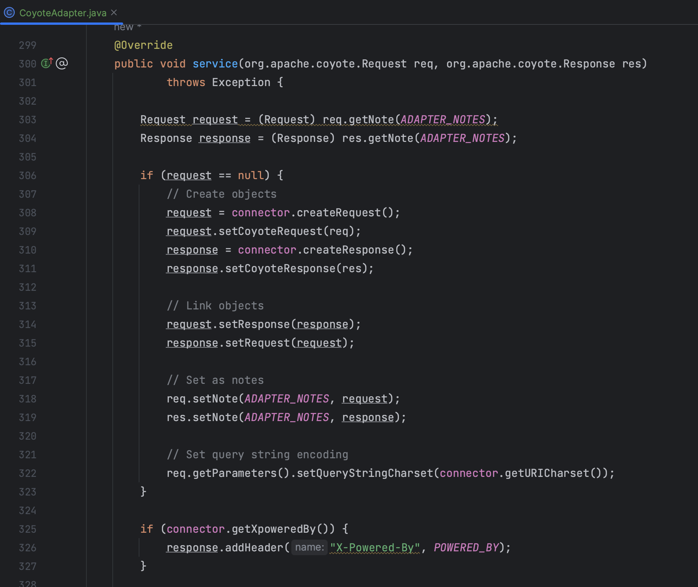

### 3.3 请求处理链

> 顺着上一节产生的`Request`和`Response`对象，这里我们进一步再探索一下这两个对象如何按`Tomcat`编排的链路最终交给`Servlet`处理的
>
> 此处需要注意后续的工作流程都将围绕一个`Pipeline`的`getFirst`方法，获取组件对应的`Valve`**链**处理当前组件的内容

- `CoyoteAdapter`通过调用`connector.getService().getContainer()`方法，获取到当前`StandardEngine`组件，`Engine`组件按`server.xml`中的配置前面已经在启动与初始化的过程中装配好了`pipeline`，进一步调用`getPipeline().getFirst()`方法得到`Engine`组件的`StandardEngineValve`，最终执行`EngineValve`的`invoke`逻辑

  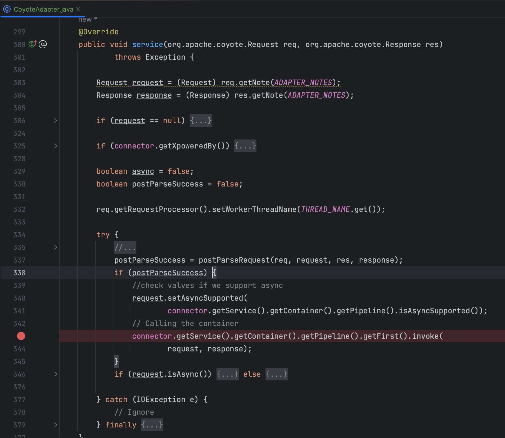

- `StandardEngineValve`主要是从当前`Request`中获取到`StandardHost`做非空判断，最后通过调用`Host`的`getPipeline().getFirst()`方法得到`Host`组件的`StandardHostValve`，最终执行`HostValve`的`invoke`逻辑

  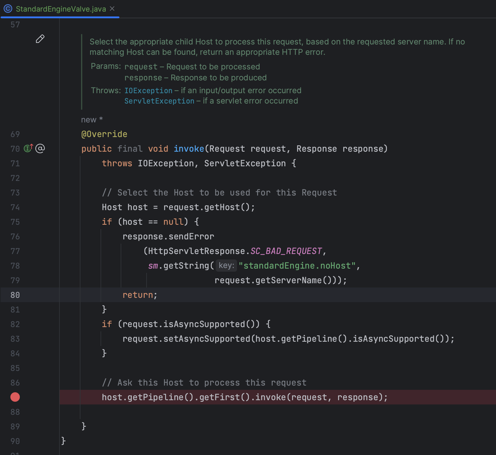

- `StandardHostValve`主要是从当前`Request`中获取到`StandardContext`做非空判断，最后通过调用`Context`的`getPipeline().getFirst()`方法得到`Context`组件的`StandardContextValve`，最终执行`ContextValve`的`invoke`逻辑

  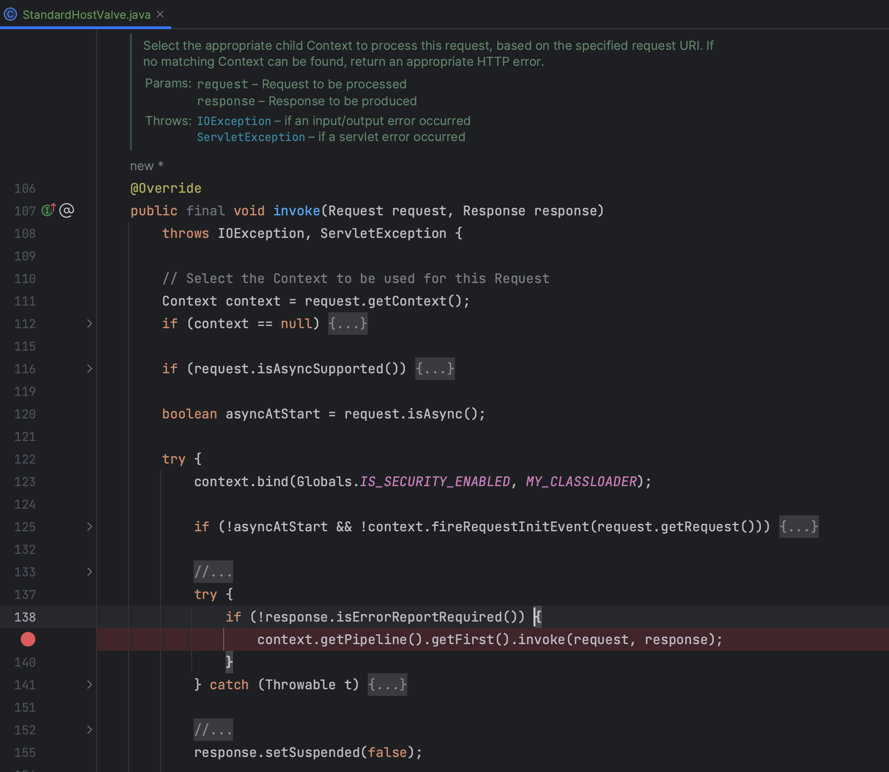

- `StandardContextValve`主要是从当前`Request`中获取到`Wrapper`做非空判断，最后通过调用`Wrapper`的`getPipeline().getFirst()`方法得到`Wrapper`组件的`StandardWrapperValve`，最终执行`WrapperValve`的`invoke`逻辑

  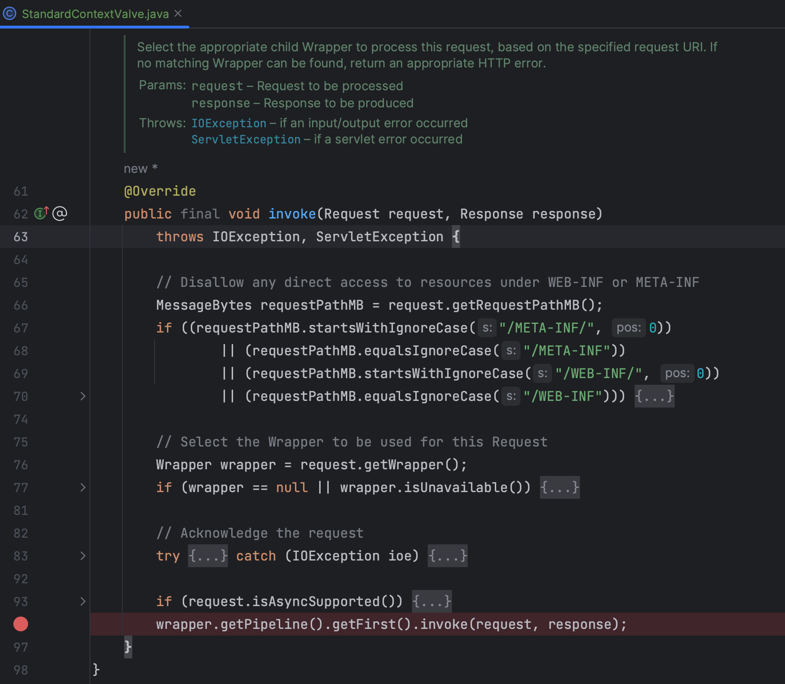

- `StandardWrapperValve`主要做两件事：一是通过反射实例化和初始化`Servlet`对象；二是通过工厂方法创建出一个`ApplicationFilterChain`并最终调用`internalDoFilter`，调度实际处理的`Servlet`执行`service`方法

  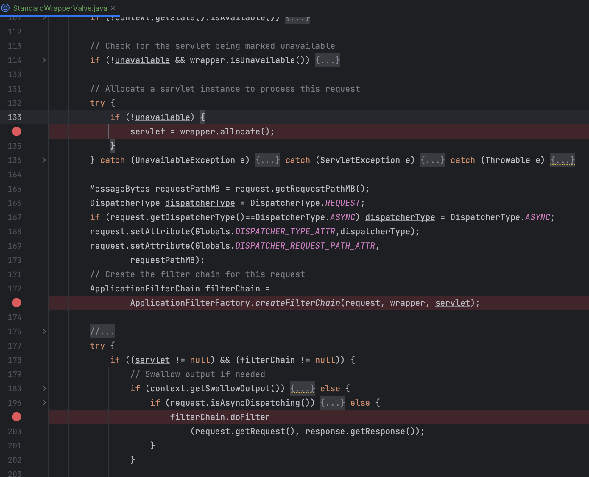

  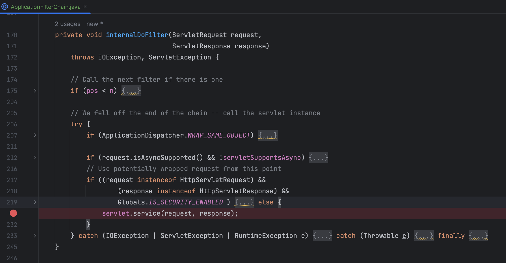

## 四、Tomcat 类加载机制


