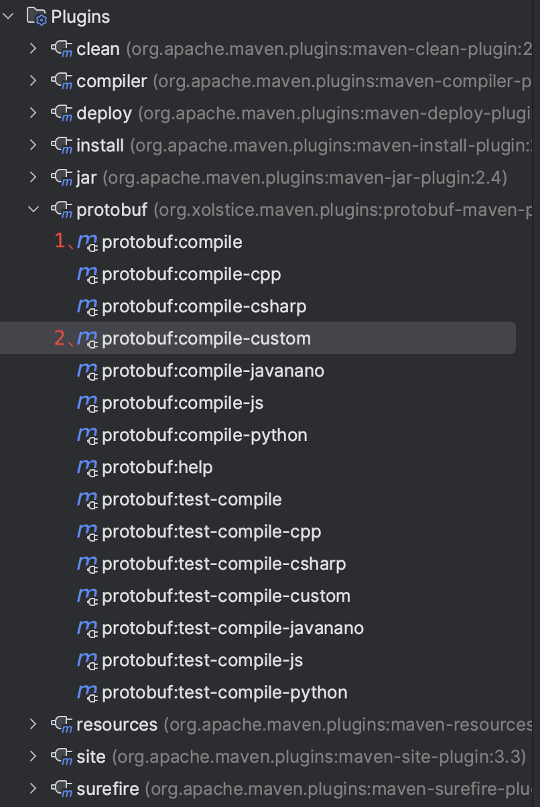
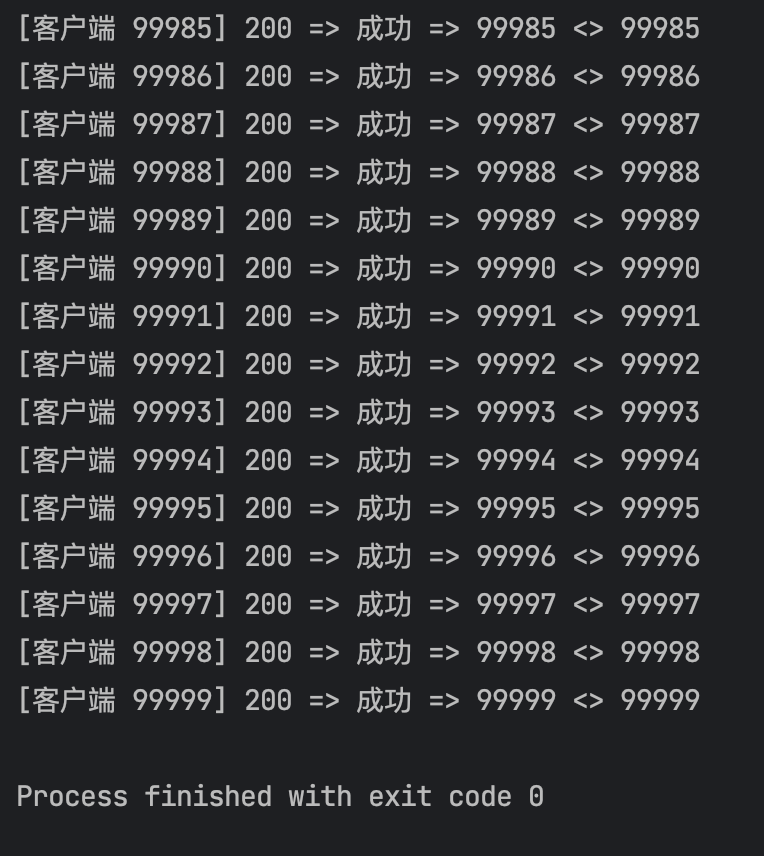

## 一、概述

> 官网：https://grpc.io/docs/

`gRpc` 是一个高性能、开源和通用的`RPC `框架，面向移动和`HTTP/2`设计。

`gRPC`基于`HTTP/2`标准设计，带来诸如双向流、流控、头部压缩、单`TCP`连接上的多复用请求等特。这些特性使得其在移动设备上表现更好，更省电和节省空间占用。

`gRpc`默认使用的是[Protocol Buffers](https://developers.google.com/protocol-buffers/docs/overview)，是`Google`开源的一种接口描述语言（**IDL**）

目前官方支持的语言以及平台如下：

| Language    | OS                     | Compilers / SDK               |
| ----------- | ---------------------- | ----------------------------- |
| C/C++       | Linux, Mac             | GCC 6.3+, Clang 6+            |
| C/C++       | Windows 10+            | Visual Studio 2017+           |
| C#          | Linux, Mac             | .NET Core, Mono 4+            |
| C#          | Windows 10+            | .NET Core, NET 4.5+           |
| Dart        | Windows, Linux, Mac    | Dart 2.12+                    |
| Go          | Windows, Linux, Mac    | Go 1.13+                      |
| Java        | Windows, Linux, Mac    | Java 8+ (KitKat+ for Android) |
| Kotlin      | Windows, Linux, Mac    | Kotlin 1.3+                   |
| Node.js     | Windows, Linux, Mac    | Node v8+                      |
| Objective-C | macOS 10.10+, iOS 9.0+ | Xcode 12+                     |
| PHP         | Linux, Mac             | PHP 7.0+                      |
| Python      | Windows, Linux, Mac    | Python 3.5+                   |
| Ruby        | Windows, Linux, Mac    | Ruby 2.3+                     |

## 二、入门使用（grpc-java）

> `gRpc`的使用有三个基本步骤：
>
> 1. 编写`IDL`文件（.proto）
> 2. 将编写的`.proto`描述文件生成为`Java`代码
> 3. 编写调用逻辑

### 2.1 编写 IDL 文件

1. 我们新建一个`maven`工程，命名为`yiwenup-sample-grpc-protocol`，这个模块用于根据`.proto`文件生成对应`Java`代码。**后续无论是消费方还是服务方都依赖此协议：消费方根据接口本地产生远程调用代理；服务方根据接口编写具体的服务逻辑。**修改`pom.xml`文件，为当前模块引入`grpc-all`依赖以及对应的代码生成插件

   ```xml
   <?xml version="1.0" encoding="UTF-8"?>
   <project xmlns="http://maven.apache.org/POM/4.0.0"
            xmlns:xsi="http://www.w3.org/2001/XMLSchema-instance"
            xsi:schemaLocation="http://maven.apache.org/POM/4.0.0 http://maven.apache.org/xsd/maven-4.0.0.xsd">
       <parent>
           <artifactId>yiwenup-sample-grpc</artifactId>
           <groupId>cloud.yiwenup.sample</groupId>
           <version>1.0-SNAPSHOT</version>
       </parent>
       <modelVersion>4.0.0</modelVersion>
   
       <artifactId>yiwenup-sample-grpc-generator</artifactId>
   
       <dependencies>
           <dependency>
               <groupId>io.grpc</groupId>
               <artifactId>grpc-all</artifactId>
               <version>1.48.1</version>
           </dependency>
       </dependencies>
   
       <build>
           <extensions>
               <extension>
                   <groupId>kr.motd.maven</groupId>
                   <artifactId>os-maven-plugin</artifactId>
                   <version>1.7.0</version>
               </extension>
           </extensions>
   
           <plugins>
               <plugin>
                   <groupId>org.apache.maven.plugins</groupId>
                   <artifactId>maven-compiler-plugin</artifactId>
                   <version>3.10.1</version>
                   <configuration>
                       <source>1.8</source>
                       <target>1.8</target>
                       <encoding>UTF-8</encoding>
                   </configuration>
               </plugin>
   
               <plugin>
                   <groupId>org.xolstice.maven.plugins</groupId>
                   <artifactId>protobuf-maven-plugin</artifactId>
                   <version>0.6.1</version>
                   <configuration>
                       <pluginId>grpc-java</pluginId>
                       <protocArtifact>com.google.protobuf:protoc:3.21.5:exe:${os.detected.classifier}</protocArtifact>
                       <pluginArtifact>io.grpc:protoc-gen-grpc-java:1.49.0:exe:${os.detected.classifier}</pluginArtifact>
                   </configuration>
                   <executions>
                       <execution>
                           <goals>
                               <goal>compile</goal>
                               <goal>compile-custom</goal>
                           </goals>
                       </execution>
                   </executions>
               </plugin>
           </plugins>
       </build>
   
   </project>
   ```

2. 在`main`目录下新建`proto`目录，用于存放`.proto`文件，此目录下的文件将会被转换为`.java`源文件

3. `.proto`文件内容参考如下，具体语法需要根据官方文档指导：

   ```protobuf
   syntax = "proto3"; // 协议版本
   
   // 选项配置
   option java_package = "cloud.yiwenup.sample.grpc.gen"; // 生成文件的包路径
   option java_outer_classname = "HelloWorldProto"; // 名称
   option java_multiple_files = true; // 生成多分java文件，便于管理
   
   // 定义请求体
   message SayHelloRequest {
     string serial = 1;
   }
   
   // 定义相应内容
   message SayHelloResponse {
     string code = 1;
     string msg = 2;
     string data = 3;
   }
   
   // 服务接口.定义请求参数和相应结果
   service SayHelloService {
     rpc sayHello (SayHelloRequest) returns (SayHelloResponse) {
     }
   }
   ```

4. 运行命令`protobuf:compile`可以生成`gRpc`相关的`Bean`；运行命令`protobuf:compile-custom`可以生成`gRpc`的服务模块，对应生成的代码，在`target/generated-sources/protobuf`目录下

   

### 2.2 编写服务端（提供方）

> 服务端根据`.proto`文件在协议层生成的代码将具体逻辑填充

1. 首先需要编写服务端的启动部分，保证服务端可以启动并且阻塞等待`shutdown`指令才可以关闭`JVM`停止服务。为此，新建一个`maven`工程`yiwenup-sample-grpc-server`，添加`grpc-all`依赖，服务端参考代码如下：

   ```java
   public class GrpcServer {
       public static void main(String[] args) {
           try {
               // 启动服务端，直到接受到termination指令
               Server server = ServerBuilder
                       .forPort(7777)
                   	// 添加服务实现逻辑
                       .addService(new SayHelloServiceImpl())
                       .build()
                       .start();
   
               System.out.println("[服务端] 启动成功...");
   
               // 当接收到shutdown信号的时候，停止服务端
               Runtime.getRuntime().addShutdownHook(new Thread(() -> {
                   System.out.println("[服务端] 正在停止JVM...");
                   server.shutdown();
                   System.out.println("[服务端] 服务已关闭...");
               }));
   
   
               server.awaitTermination();
           } catch (Exception e) {
               throw new RuntimeException(e);
           }
       }
   }
   ```

2. 在服务启动代码中，需要添加一系列基于协议层实现的具体逻辑，譬如上述代码中的`SayHelloServiceImpl`便是如此。因此本`maven`工程还需要添加协议层依赖`yiwenup-sample-grpc-protocol`，实现逻辑参考代码如下：

   ```java
   public class SayHelloServiceImpl extends SayHelloServiceGrpc.SayHelloServiceImplBase {
   
       private AtomicInteger atomicInteger = new AtomicInteger();
   
       @Override
       public void sayHello(SayHelloRequest request, StreamObserver<SayHelloResponse> responseObserver) {
           String serial = request.getSerial();
   
           try {
               responseObserver.onNext(SayHelloResponse.newBuilder()
                       .setCode("200")
                       .setMsg("成功")
                       .setData(serial + " <> " + atomicInteger.getAndIncrement()).build());
           } catch (Exception e) {
               responseObserver.onError(e);
           } finally {
               responseObserver.onCompleted();
           }
       }
   }
   ```

3. 至此，服务端就准备完毕了，启动服务端，可以看到控制台的打印信息，以及在关闭服务端的时候也有信息打印。

   

### 2.3 编写客户端（消费方）

> 客户端根据`.proto`文件在协议层生成的代码直接本地调用，底层通过代理实现`RPC`

1. 新建一个`maven`工程，添加两个依赖：`grpc-all`以及`yiwenup-sample-grpc-protocol`，本示例在客户端启动完成之后立即远程调用服务，之后关闭客户端。

   ```java
   public class GrpcClient {
       public static void main(String[] args) {
           // 建立和服务端的一个 channel
           ManagedChannel channel = ManagedChannelBuilder
                   .forAddress("localhost", 7777)
                   .usePlaintext()
                   .build();
   
           try {
               // 获取接口的代理对象
               SayHelloServiceGrpc.SayHelloServiceBlockingStub sayHelloServiceBlockingStub = SayHelloServiceGrpc.newBlockingStub(channel);
   
               // 本地调用
               for (int i = 0; i < 100000; i++) {
                   SayHelloResponse sayHelloResponse = sayHelloServiceBlockingStub.sayHello(SayHelloRequest.newBuilder().setSerial(String.valueOf(i)).build());
                   System.out.println("[客户端 " + i + "] " + sayHelloResponse.getCode() + " => " + sayHelloResponse.getMsg() + " => " + sayHelloResponse.getData());
               }
           } catch (Exception e) {
               throw new RuntimeException(e);
           } finally {
               if (channel != null) {
                   channel.shutdown();
               }
           }
       }
   }
   ```

2. 在服务端启动着的前提下，运行客户端程序。

   
