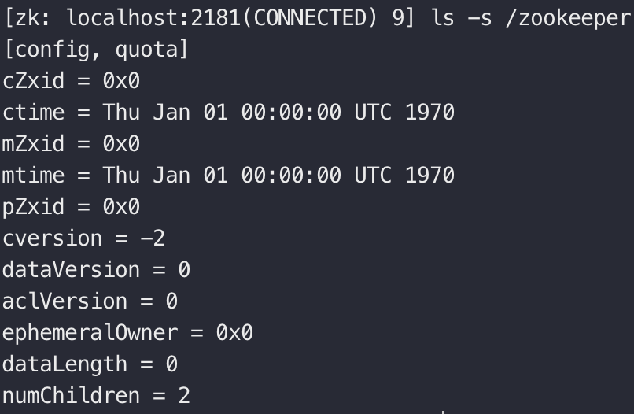
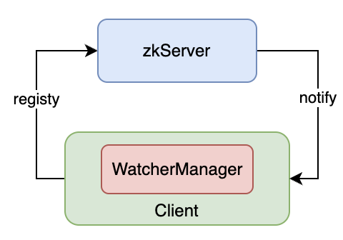

## 一、节点模型

`zookeeper`最基本的数据单元称为一个`ZNode`，这些`ZNode`按树形结构组织相互之间的关系，`ZNode`会唯一对应一个路径（路径就是构成树形组织的因素），同时也能存储一些数据。

`zookeeper`的每一个`ZNode`都有一种类型，总类可以分为以下四类：

- Persistent：持久型节点。常⻅的⼀种节点类型，节点被创建后会⼀直存在服务器，直到删除操作主动清除

- Ephemeral：临时型节点。会被⾃动清理掉的节点，它的⽣命周期和客户端会话绑在⼀起，客户端会话结束，节点

  会被删除掉。**与持久性节点不同的是，临时节点不能创建⼦节点**

- Sequential：顺序节点。顺序特性实质是在创建节点的时候，会在节点名后⾯加上⼀个数字后缀，来表示其顺序

- Container：容器节点。该节点在其下挂的所有子节点被移除后，会进入待删除状态，zk 服务会选择在合适的时间删除容器节点

基于以上三类的组合，`ZNode`可以有以下节点类型：**持久型、顺序型、持久顺序型、临时顺序型**

## 二、节点信息

通过`ls -s <path>`可以查看指定路径节点的信息

其中：

- cZxid（Create ZXID）：表示节点被创建时的事务ID。
- ctime（Create Time）：表示节点创建时间。
- mZxid（Modified ZXID）：表示节点最后⼀次被修改时的事务ID。
- mtime（Modified Time）：表示节点最后⼀次被修改的时间。
- pZxid： 表示该节点的⼦节点列表最后⼀次被修改时的事务ID。只有⼦节点列表变更才会更新 pZxid，⼦节点内容变更不会更新。
- cversion：表示⼦节点的版本号。
- dataVersion：表示内容版本号。
- aclVersion：标识acl版本
- ephemeralOwner：表示创建该临时节点时的会话 sessionID，如果是持久性节点那么值为 0
- dataLength：表示数据⻓度。
- numChildren：表示直系⼦节点数

## 三、事件监听

在 `ZooKeeper` 中，引⼊了 `Watcher` 机制来实现这种分布式的通知功能。`ZooKeeper` 允许客户端向服务端注册⼀个 `Watcher` 监听，当服务端的⼀些指定事件触发了这个 `Watcher`，那么就会向指定客户端发送⼀个事件通知来实现分布式的通知功能

`Zookeeper`的`Watcher`机制主要包括**客户端线程、客户端WatcherManager、Zookeeper服务器**三部分。

具体⼯作流程为：

1. 客户端在向`Zookeeper`服务器注册的同时，会将`Watcher`对象存储在客户端的`WatcherManager`当中
2. 当`Zookeeper`服务器触发`Watcher`事件后，会向客户端发送通知，客户端线程从`WatcherManager`中取出对应的`Watcher`对象来执⾏回调逻辑

## 四、ACL

`Zookeeper`作为⼀个分布式协调框架，其内部存储了分布式系统运⾏时状态的元数据，这些元数据会直接影响基于`Zookeeper`进⾏构造的分布式系统的运⾏状态，因此，如何保障系统中数据的安全，从⽽避免因误操作所带来的数据随意变更⽽导致的数据库异常⼗分重要,在`Zookeeper`中，提供了⼀套完善的``ACL（Access Control List）``权限控制机制来保障数据的安全。

通常一个有效的`ACL`信息，在`zk`中通过`<schema>:<id>:<permission>`来标识，其中：

- schema：权限模式，包含：`ip`、`digest`、`world`、`super`四种策略

- id：授权对象，权限赋予的⽤户或⼀个指定实体，在不同的权限策略下，授权对象是不同的

  | 权限模式 | 授权对象                                                     |
  | -------- | ------------------------------------------------------------ |
  | ip       | 通常是⼀个IP地址或IP段：例如：192.168.10.110 或192.168.10.1/24 |
  | digest   | 通常是username:BASE64(SHA-1(username:password))              |
  | world    | 只有⼀个ID ：anyone                                          |
  | super    | 超级用户                                                     |

- permission：通过权限检查后可以被允许执⾏的操作

  -  CREATE（C）：数据节点的创建权限，允许授权对象在该数据节点下创建⼦节点。
  - READ（R）：数据节点的读取权限，允许授权对象访问该数据节点并读取其数据内容或⼦节点列表等。
  - WRITE（W）：数据节点的更新权限，允许授权对象对该数据节点进⾏更新操作。
  - DELETE（D）：⼦节点的删除权限，允许授权对象删除该数据节点的⼦节点。
  - ADMIN（A）：数据节点的管理权限，允许授权对象对该数据节点进⾏ ACL 相关的设置操作

