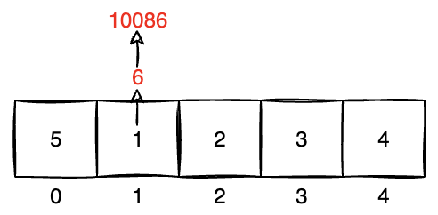
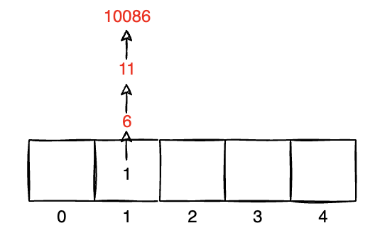

> 分布式一定是集群，而集群不一定是分布式的。
>
> 分布式是指将一个系统拆分为多个**子系统**，每个子系统负责各自的功能模块，独立部署各司其职
>
> 集群是指让多个实例共同工作，最常见/最简单的集群就是将一个应用复制多份部署。

## 一、什么是Hash

- 我们从一个场景展开思考：现在有一组数据（比如：1、3、2、6、5、4），需要根据给定的 n，判断这个 n 在不在这组数据中，最简单能想到的就是遍历这个数组，当匹配到 n 这个数据的时候返回出去。这便是**顺序查找法**，这种查找方式的时间复杂度为**`O(n)`**

- 基于上述算法时间复杂度过长，我们考虑采用排序搭配**折半查找法**实现，这种查找方式的时间复杂度从查询考虑的话是**`O(logn)`**

- 那么能不能更快呢？我们再思考**用一个数组 arr 作为容器存放这批数据，每个数据都存放在对应索引的位置，即 1 存放在 arr[1] 的位置**，那么查询的时候只要对应查找`arr[n]`，如果不为空则表示存在。这便是**直接寻址法**，这种查找方式的时间复杂度为**`O(1)`**

  

- 基于<u>直接寻址法</u>的思路，我们假定这组数据数据间的差值很大（比如：1、3、2、6、5、4、10086），那么就<u>会造成过多的空间浪费</u>。为了解决这个问题，我们引入一种算法`index = n % arr.length`，即**框定一个定长的数组，用数值对数组长度取余，得到的值就是索引位置**，这便是<u>**除留余数法**，相对来说会尽可能的压缩空间</u>。

  

- 在除留余数法的基础上，我们进一步讨论，假设数组长度取值为 5，而数据集为 [1、3、2、6、5、4、10086]，那么就会导致数据 1、6、10086 都落在索引为 1 的位置，出现**哈希冲突**。

  

- 为解决哈希冲突问题，通常会采用**拉链法**解决，即将经过一系列计算后会出现冲突的值，用链表挂在当前索引下，但是假设在极端的条件下，所有数据都会有可能悬挂在同一索引下，还是会导致查询时间复杂度过高。

  

  

- 综上推导，我们知道**`Hash`是一类算法，具体算法的设计会和查询效率直接相关，越能够使数据均匀分布则查询效率越高，时间复杂度越趋近于`O(1)`**。

## 二、Hash的应用场景

> `Hash`算法总结下来可以分为两大类场景：
>
> - 请求路由的负载均衡：比如`Nginx`的`ip_hash`复杂均衡策略，还有`Hadoop`集群架构等具体场景
> - 分布式的存储解决方案：比如`Redis`集群中根据`key`的`hash`值决定存储的节点、还有`MySQL`集群架构、`ElasticSearch`集群架构等具体场景

以`Nginx`的`ip_hash`为例说明，`Nginx`的`ip_hash`策略借助`hash`实现了会话粘滞效果，即在客户端`ip`不变的情况下，总是能够将请求的路由到相同的服务实例。

此外，在参考`Nginx`源代码中关于`ip_hash`部分的实现，可以发现他还做了一点设计，即**取客户端`ip`地址的前`3`段参与`hash`运算，意味着只要`ip`地址前`3`段相同，那么其`hash`值就是一致的，这是因为`ip`地址前`3`段相同的节点我们通常认为是在同一个局域网内的，因此这么设计的目的是为了保证能让同一局域网下的节点总是能请求到相同的一个服务实例上**。
