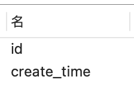

> 分布式一定是集群，而集群不一定是分布式的。
>
> 分布式是指将一个系统拆分为多个**子系统**，每个子系统负责各自的功能模块，独立部署各司其职
>
> 集群是指让多个实例共同工作，最常见/最简单的集群就是将一个应用复制多份部署。

> 分布式ID要讨论的是在分布式集群场景下，能够生成全局唯一的ID用于标识数据，典型的比如：MySQL在分表之后需要保证各表中数据ID不能重复，因此无法继续沿用主键自增策略。
>
> 针对分布式集群下的ID生成策略，总结有以下四种方案可以参考：
>
> - UUID
> - 全局自增表
> - 雪花算法
> - Redis的Incr命令

## 一、UUID

> 推荐指数：:star::star::star::star:

一般而言，`UUID`的生成会参考非常多的因素，因此**重复的概率是非常低**的，几乎可以忽略不计。

作为`JDK`内置的`API`，使用上无疑是最方便的。

但是由于`UUID`的无序性，因此**不建议作为主键或者索引字段考虑**，因为可能会导致数据库建立索引分散，浪费数据库资源的同时也会影响性能。

```java
String uuid = UUID.randomUUID().toString();
```

## 二、全局自增表

> 推荐指数：:star:

该方案需要借助数据库主键自增特性，操作步骤如下：

1. 建议区别于业务库创建一个`id`库，并在库中创建自增表`global_id`，这张表设计一个`id`字段为自增主键，随意创建一个字段比如`create_time`用于插入数据；

   

2. 后续在业务表新增数据之前，先来`global_id`表插入一条记录，使`id`自增，再通过`select last_insert_id()`查询出刚新增的`id`即位当前业务表要使用的`id`

   ```sql
   insert into global_id (`create_time`) values (now());
   select last_insert_id();
   ```

**该方案涉及多数据源，存在`I/O`性能问题；并且依赖自增库表的稳定，存在可靠性问题，一般不推荐使用**。

## 三、雪花算法

> 推荐指数：:star::star::star::star:

雪花算法是一类算法的表示，目标是生成一个`long`类型的数据，在`Java`中`long`类型是`8B`，因此在操作系统底层是`64bit`。**雪花算法利用`64`位长度来表达某个机房机器在某一毫秒所生成的一串递增序列**。


- 符号位：在操作系统底层对于有类型的数值，第一位都是用来表示正负数的，称为符号位，`0`表示整数，`1`表示负数。**作为雪花算法要生成的数据应该是正数，因此这一位始终是`0`**。
- 时间戳：占`41`位长度，单位为毫秒
- 机器ID：占`10`位长度。**按照`hutool`的实现策略，这`10`位会进一步拆分，前`5`位表示数据中心`ID`，后`5`位表示机器`ID`，因此数据中心可以支持最大值为`31`，机器可以支持最大值为`31`**。
- 递增序列：占`12`位长度，**可以支持最大值为`4095`**。

```java
// import cn.hutool.core.lang.Snowflake;

Snowflake snowflake = new Snowflake(17L, 23L);
long snowflakeId = snowflake.nextId();
```

## 四、Redis的Incr命令

> 推荐指数：:star::star::star::star::star:

`Redis`的`Incr`命令会对指定的`key`进行`value`自增。如果`key`不存在则会初始化`value`值为`0`并完成自增，因此返回的值实际为`1`。

```java
// import redis.clients.jedis.Jedis;
try (Jedis jedis = new Jedis();) {
    System.out.println(jedis.incr("global_id").longValue());
}
```


